# Architecture

How Bacchat is put together, as built. See [decisions.md](decisions.md) for the reasoning and [backend.md](backend.md) for the sync service. Things that could not be checked in the build sandbox are listed in section 14.

## 1. System context

Everything runs on the phone by default. The only network traffic is anonymous public NAV fetches, optional encrypted sync, and optional calls to the user's own AI provider (or a model downloaded from a URL, once).

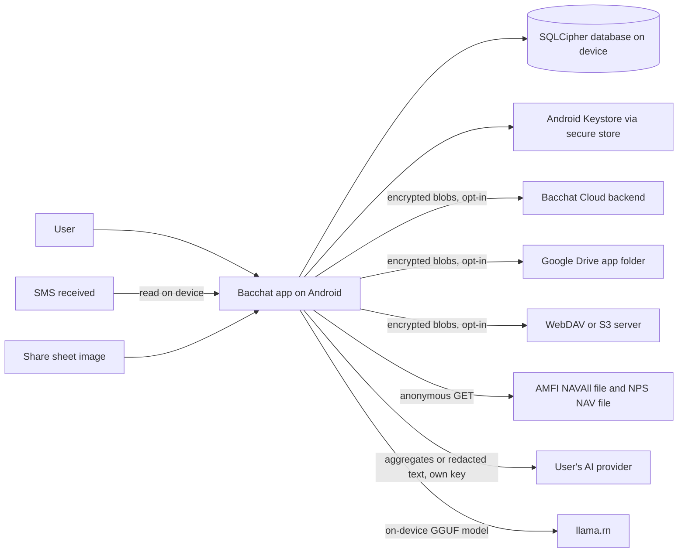

Email is read from text the user pastes or shares; there is no mailbox integration (see section 7).

## 2. Frontend layering

Dependencies point downward. Screens read data through hooks from `services/` and never open the database or call native modules directly.

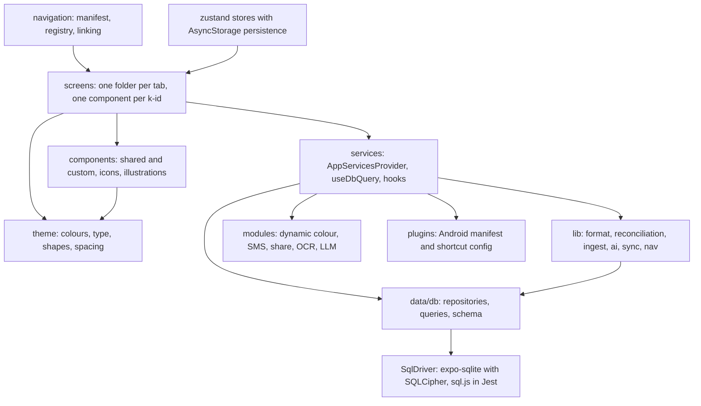

State: database reads go through `useDbQuery`, which re-runs when the observable database emits a write. Small preferences (theme, AI mode, Home order, Money segment, budgets view, first run) are zustand stores persisted to AsyncStorage via `lib/persistence` and hydrated before first paint. Secrets (DB key, API keys, sync token and master key) go in the secure store only.

Folder map (`frontend/`):

| Path | Holds |
|---|---|
| `App.tsx`, `index.ts` | Provider order: fonts and hydration gate, ThemeProvider, AppLockGate, AppServicesProvider, navigation |
| `src/theme/` | `oklch`, `khataPalette`, `dynamicScheme`, `contrast`, `contrastGuard`, `resolveColors`, `paperTheme`, `typography`, `shapes`, `spacing`, `fonts`, `ThemeProvider` |
| `src/components/` | Charts, keypad, tooltip, banner, skeleton, rows, tags; `icons/` (25 custom SVG icons), `illustrations/` (ink scenes), `iconMap.ts` |
| `src/screens/` | `start`, `home`, `money`, `goals`, `you`, `debug`; each screen `K<n>_<Name>.tsx` with helper folders beside it |
| `src/navigation/` | `screenManifest` (single source of screens), `registry`, `AppNavigator`, `TabBar`, `linking`, `edges`, `navigate`, `moneySegment` |
| `src/data/` | `db/` (models, schema, repositories, queries, seed, drivers), `sampleData`, `homeConfig`, `categoryIconCatalog` |
| `src/lib/` | `format`, `reconciliation`, `i18n*`, `preferences`, `persistence`; `ai/`, `ingest/`, `sync/`, `nav/` |
| `src/services/` | App wiring: services factory, db key, secure store, settings, AI service, ingest service, share service, SMS headless task, OCR hook, app lock, Google auth, model files |
| `modules/` | Local Expo modules: `bacchat-dynamic-color`, `bacchat-sms`, `bacchat-share`, `bacchat-ocr` (Kotlin), `bacchat-llm` (TypeScript over llama.rn) |
| `plugins/` | Config plugins: share intent, launcher shortcut, hardened manifest, Google OAuth redirect, notification icon |

## 3. Theming pipeline

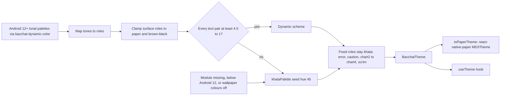

- `modules/bacchat-dynamic-color` returns the system accent1, accent2, accent3, neutral1 and neutral2 tonal palettes. `dynamicScheme.ts` maps tones to roles (for example primary is accent1 tone 600 in light, 200 in dark). Nothing else is taken from the wallpaper.
- `resolveColors(mode, source)` starts from `khataPalette(45, mode)`, overlays the mapped roles, then clamps each surface role: a light surface brighter than luminance 0.94, or a dark one darker than 0.004, is replaced by the khata value.
- `schemeHasContrast` checks seven text pairs (onSurface and onSurfaceVariant on surface, plus the on-X roles on primary, primaryContainer, secondaryContainer, tertiaryContainer and inverseSurface) at 4.5:1. Any failure returns the whole khata palette.
- `ThemeProvider` follows the OS light or dark mode unless the `theme` preference forces one, and re-reads the wallpaper when the app returns from the background. The `wallpaperColors` preference turns dynamic colour off.
- `oklch.ts` converts oklch to sRGB hex. Screens never hold hex values (lint bans hex literals outside tests); they read roles from `useTheme()`.

## 4. Navigation structure

The navigator is flat, not nested per tab. A root native stack starts on k21. Every non-tab screen is a root-stack route; the route `main` hosts a custom-tab-bar bottom tab navigator (home k1, money, goals k12, you k23). The Money tab holds a small stack with k3 and k4 and opens on whichever was last used (`moneySegment`, persisted). Sheets and menus (k9, k18, k27) are transparent modal routes sliding up; the date dialog (k6) is a transparent modal with a fade. The tab bar only exists inside `main`, so it is visible exactly on k1, k3, k4, k12, k23.

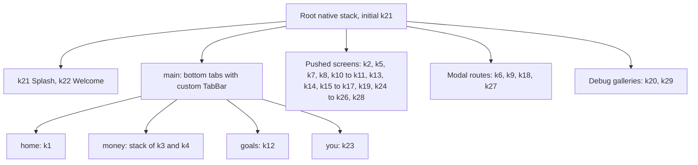

`screenManifest.ts` is the single table of screens (k-id, route, group, kind); `registry.ts` maps each k-id to its component; `edges.ts` lists the non-tab transitions that [screens.md](screens.md) draws. Back always pops to the parent. k20 and k29 are developer component galleries; no UI link leads to them.

Deep links (`navigation/linking.ts`, scheme `bacchat://`):

| Link | Opens | Used by |
|---|---|---|
| `bacchat://add` | k5 Add entry | Launcher shortcut "Add entry" (`plugins/withShortcuts`) |
| `bacchat://import?uri=<encoded>` | k7 Reading screenshot | `shareService`, after an image arrives through the share sheet |
| `bacchat://entries?filter=review` | k4 Entries, To review filter | "From SMS" notification |
| `bacchat://home`, `money`, `goals`, `you` | Tab roots | Convenience |

Non-k-id surfaces: the lock screen (`LockScreen`, shown by `AppLockGate` over the whole app), the pending conflicts sheet and banner on k4 (`screens/money/pending`), and dialogs inside k25 (pairing code, recovery key). They are listed in [screens.md](screens.md).

## 5. Data model

Money is integer paise. Every table row has `id`, `updatedAt` (epoch ms, stamped by the repository) and an optional `deletedAt` tombstone used by sync. Each table stores the full record as JSON plus a few indexed columns, so new optional fields need no migration. Schema version is in `PRAGMA user_version` (currently 2: version 1 core tables, version 2 adds `screenshots` and `asks`).

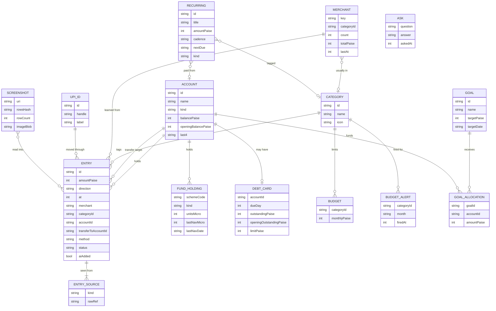

Notes:
- `ENTRY_SOURCE` is not a table; it is the `sources` array inside an entry (`kind` is `sms`, `mail`, `shot` or `hand`; `rawRef` is an opaque reference to the raw message). A second source on an existing entry is another array item, not a duplicate entry.
- `status` is `confirmed` or `toReview`; `aiAdded` marks entries added by a parser or model.
- `direction` is `out` or `in`. A transfer sets `transferToAccountId`: it leaves `accountId`, enters the target and is not spend.
- Balances are derived. `openingBalancePaise` (accounts) and `openingOutstandingPaise` (debts) are the balance before the first entry; the current figure is opening plus the effect of every live entry (`data/db/queries/balances.ts`). Nothing edits `balancePaise` to follow entries.
- NAVs are stored as `lastNavMicro` (rupees times 1e6) and units as `unitsMicro`, because NAVs have four decimals and paise would lose precision. Valuation rounds to paise at the end.
- Tables without a diagram link: `merchants` (history used to infer categories), `alerts` (one overspend alert per category per month), `meta` (key-value: seed flag, pending SMS conflicts). `ASK` holds Ask history, kept only if the user turns that on; screenshots keep metadata only, image bytes sync only with "Original screenshots" on.
- Indexes: entries on `(at)`, `(accountId, at)`, `(categoryId, at)`; merchants on `key`; alerts on `(categoryId, month)`; asks on `updatedAt`.
- Fresh installs are seeded with sample data (a visible "sample" mode) until the user leaves it (`exitSampleMode`).

## 6. Reconciliation (screenshot import)

A screenshot is read with on-device OCR (ML Kit through `modules/bacchat-ocr`; a stub engine is used when the module is absent), parsed into candidate rows, then each row is compared with entries on the same day. Rule: amount (exact) + time (within 10 minutes) + merchant (fuzzy, similarity at least 0.75).

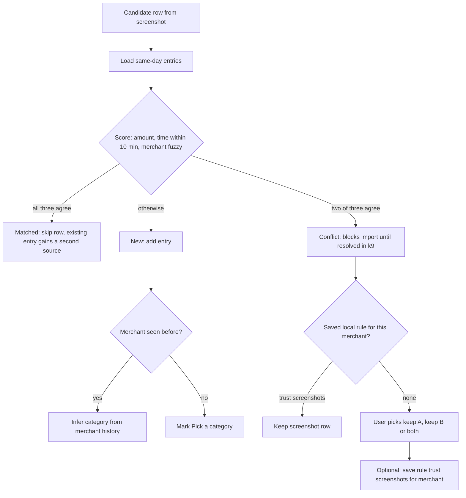

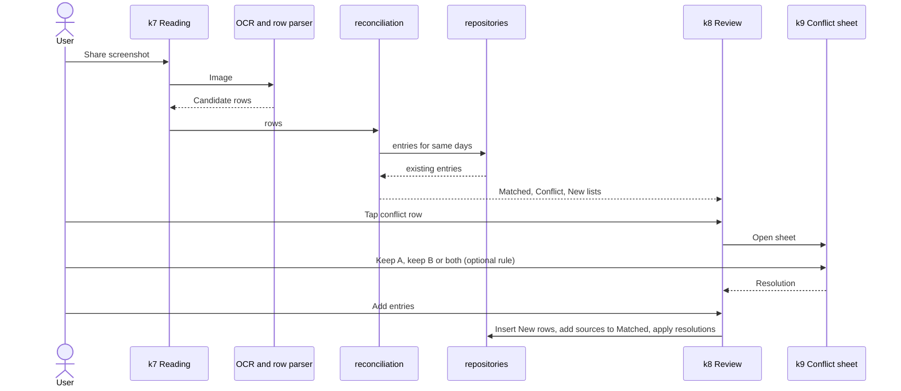

`lib/reconciliation.ts` is pure (rows and entries in, classification out), so it is unit tested without UI. `TIME_WINDOW_MS` and `MERCHANT_THRESHOLD` are constants in that file.

## 7. SMS and email ingestion

Reading happens on the device. Rules (`lib/ingest`: `parseSms`, `parseEmail`, `categorise`) run first. A model is used only when the AI router allows it (section 13).

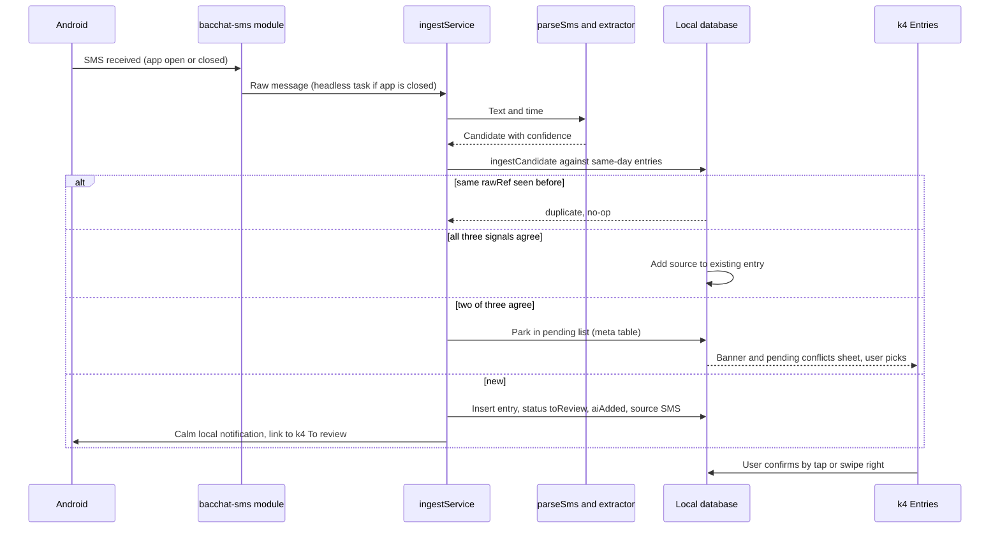

- SMS reading is off by default (Settings, k24). Turning it on runs a one-time backfill scan. The app asks for `READ_SMS`, `RECEIVE_SMS` and `POST_NOTIFICATIONS`; without them the rest of the app works.
- A message that clashes with an existing entry is never inserted on its own. It waits in the pending list on this phone until the user chooses keep existing or keep both.
- Email: there is no mailbox integration. `services/emailSource.ts` defines the interface a future provider would fill, and the working path is pasting or sharing an email into the app, which goes through `parseEmail`.
- AI-added entries are flagged To review and shown with a dashed outline until confirmed.

## 8. AI advisor

The advisor is an MCP-style client inside the app. Tools are read-only functions over local data that return aggregates.

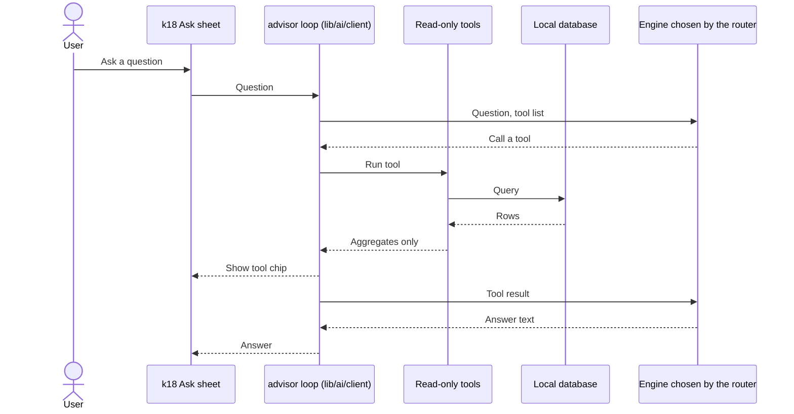

- Five tools, all read-only: `goals`, `cash_flow`, `card_dues`, `affordability`, `spend_summary`. There is no tool that writes or deletes, and a test asserts none is registered.
- Only aggregates leave the device (totals, counts, dates). Each result is scanned for payee names, account names, UPI ids, notes and message references and blocked on a hit. The sheet says so.
- The Anthropic key is stored in the secure store (Android Keystore), never in the database, preferences or sync blobs. Ask history is optional and local (`asks` table).
- Opened from the Ask pill, an Ask row in You, and insight cards. Always a bottom sheet, never a takeover.

## 9. Sync

Sync is off by default. The engine talks to a `SyncTarget`, never to a concrete server, so every target stores the same opaque ciphertext blobs.

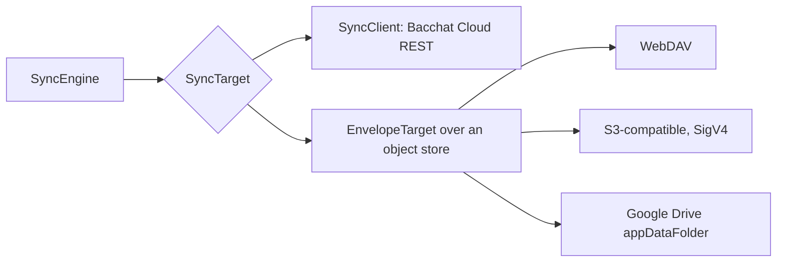

Key hierarchy. A random 32-byte master key encrypts every blob. The master key is wrapped twice and the wraps are stored in a public `keyring` blob: once by a key derived from the passphrase with Argon2id (salt and cost parameters in the keyring), once by a random recovery key shown to the user at setup (base32). Changing the passphrase re-wraps the master key and never re-encrypts data. A second phone joins with a pairing code (Bacchat Cloud) and the passphrase or recovery key, and opens the keyring.

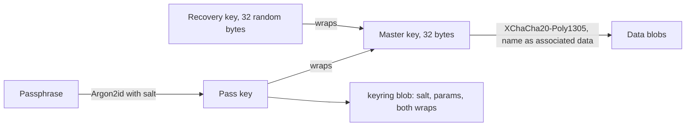

Data sets and blobs: `entries` (with `accounts` and `goals`), `categories`, `budgets` and `rules`, `screenshots` (image bytes only with the option on), and `asks` (history, off by default). The K25 checkboxes choose which groups sync, plus a Wi-Fi-only switch.

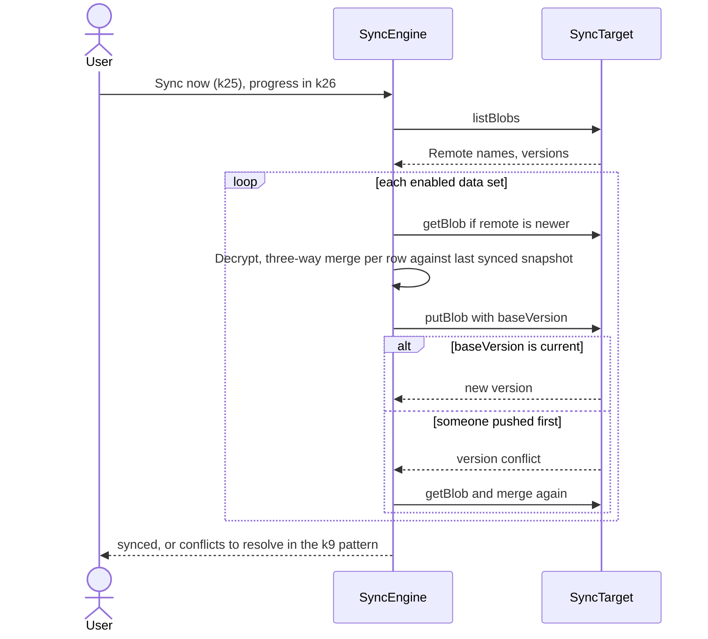

- Merge is per row against the snapshot from the last sync. A row changed on one side takes that change (deletions are tombstones). A row changed on both sides becomes a conflict, resolved with keep A, keep B or both. A `newest` policy (last writer wins) exists but the default is `ask`.
- Nonce: 24 random bytes per blob write. Blob name and format version are bound as associated data (`bacchat/blob/v1/<name>`).
- Rollback guard: if the remote version is older than the one this phone last saw, the engine stops with `RollbackError` instead of overwriting.
- Targets without a version counter (WebDAV, S3, Drive) keep the integer version inside a small JSON envelope and use ETag preconditions (`If-None-Match: *` to create, `If-Match` to replace). Drive has no reliable conditional write, so files are write-once (`<name>.v<N>.bacchat`) and the oldest creator wins a race.
- Credentials, target config and the master key are held together in the secure store; preferences hold only the on/off switch and the checkboxes.
- Blobs are not compressed before encryption.

## 10. Security model

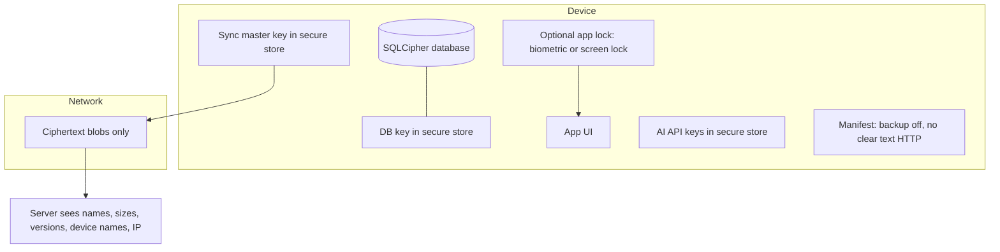

| Asset | Protection |
|---|---|
| Local data | SQLCipher at rest; random 256-bit key generated once and kept in the Android Keystore through expo-secure-store; Android backup is switched off by `withHardenedManifest` so the database and key never ride along |
| App lock | Optional. `expo-local-authentication` prompt on cold start and after 60 s in the background; the app stays mounted but hidden from TalkBack while locked |
| Sync data | Encrypted on device before upload; server never has the key |
| Passphrase | Never leaves the device; Argon2id stretches it; recovery key offered at setup |
| AI keys | Secure store; sent only to the chosen provider; never logged |
| Message text | Redacted before any cloud call, consent per provider, on-device model sees the original text (section 13) |
| Account on server | Random 256-bit token returned once; server stores its SHA-256 hash |
| Public fetches | Anonymous GET; no identifiers sent |

Out of scope: a rooted or compromised phone, and weak passphrases (the UI shows strength and nudges toward the recovery key). See [backend.md](backend.md) for the server threat model.

## 11. Deployment

There is no CI in this repository. Images and app builds are made locally.

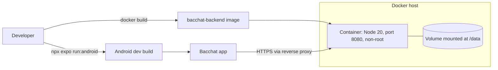

TLS is terminated by a reverse proxy in front of the container (see [backend.md](backend.md)). The app can point at any compatible host, so self-hosting is first class. The app is a development build: native modules mean Expo Go does not work.

## 12. Performance and offline notes

- Offline first: every screen works with no network. Network failures only affect NAV refresh, AI, model download and sync, and each shows a calm inline state.
- NAV refresh runs at most once per local day (`lastNavRefreshDay`) and the NAV text is cached for 12 hours; on failure the stored NAVs are used and a stale note is shown.
- Date-range queries use the entries indexes. Summaries and charts are computed in TypeScript over the entries loaded for the range (`data/db/queries`), not by SQL aggregates. Entries lists are plain `ScrollView`s grouped by day. Both are fine for thousands of rows; very large histories would need paging or SQL aggregation (see decisions.md).
- Charts are small `react-native-svg` components. No Skia.
- Database open and key creation happen behind the splash; first paint waits for fonts and persisted stores (`useHydrated`).
- Fonts (Young Serif, Figtree) load through expo-font before the app renders.
- Font scale to 200% and reduce motion are honoured (`useReduceMotion` swaps motion for fades).
- Sync pushes only data sets that changed and skips when Wi-Fi-only is on and the phone is on mobile data.
- The on-device model is loaded lazily on first use and unloaded when the app goes to the background (`useAppLifecycle`).

## 13. AI routing: cloud key, on-device model, or both

Every AI feature (Ask advisor, SMS and email reading, category suggestions, OCR name clean-up, insight text) goes through one router. The user chooses where AI runs in Settings: no AI, their own cloud key, a model on this phone, or Auto. No feature is tied to one engine, and no feature is denied by either. The backend does no inference.

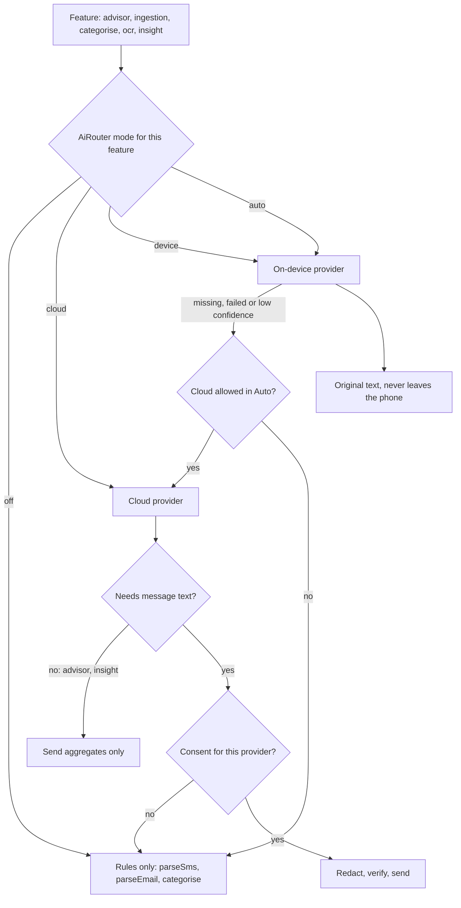

Modes and overrides. Preferences live in their own persisted store (`lib/ai/prefs.ts`, key `bacchat.ai`): `aiMode` (off, cloud, device, auto), `aiFeatureModes` (overrides for advisor, ingestion, categorise; OCR follows categorise and insight follows advisor), provider choice, OpenAI-compatible base URL and model, `aiAutoCloudFallback`, `aiActiveModelId`, and `aiConsent` (provider key to the time it was given). API keys are never in preferences: the Anthropic key and model stay where they were (secure store), and the OpenAI-compatible key is in the secure store under `bacchat.ai.openai.key`.

Layers.

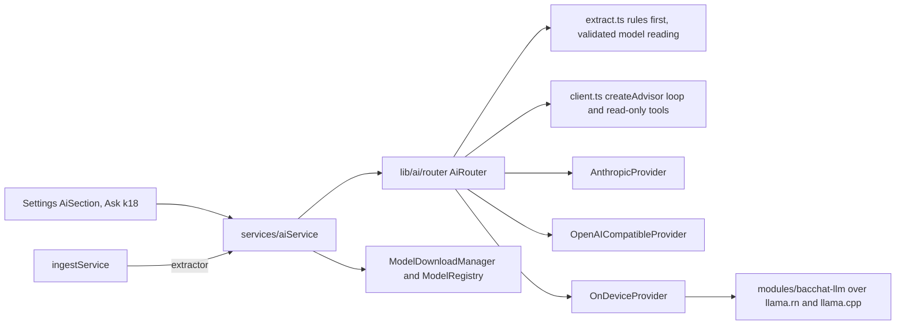

Privacy boundaries.

- Advisor and insights: only the aggregates the read-only tools return. Each tool result is also scanned for payee names, account names, UPI ids, notes and message references and blocked on a hit. This is the same on every engine.
- Message reading, tagging and OCR clean-up need raw text. On the phone's model the original text is used and nothing leaves the phone. For a cloud provider the text is redacted first (`lib/ai/redact.ts`): OTPs and codes, balances and limits, card and account numbers (last 4 kept), phone numbers (also inside UPI handles), email addresses (domain kept), PAN and Aadhaar. The amount, date, payee name, last-4 digits and UPI handle stay, because they are what the model must read. A second check refuses to send text that still matches a sensitive pattern. Text the rules call not-a-payment (OTPs, offers, reminders) never goes to any model.
- Consent: a cloud provider is called for message text only after explicit, one-time consent for that provider (a self-hosted endpoint counts per host). The router leaves the cloud engine out of the plan without consent, and a guard on the provider re-checks at call time, so withdrawing consent stops calls at once. Settings shows a calm disclosure line next to the switch. When a message is read by rules only because consent is missing, Settings says so once.
- Nothing is logged: prompts, message text, model output and keys never reach a log. Errors shown to people are the calm fixed messages in `lib/ai/errors.ts`.

Hybrid ingestion. `extractTransaction(text, ctx)` runs the rule parser first and accepts it at confidence 0.75 or more. Otherwise the router asks a model for strict JSON (amount as printed, direction, merchant, time, method, last-4, UPI id, category name from the user's list). The answer must pass a schema and then cross-checks: the amount must appear in the original text, must not equal the balance or limit, and must agree with the rule parser when it found something; digits, UPI id and merchant must be present in the text or are dropped; the category must be one of the user's. A failed check is sent back to the model once with the reason, then refused. Accepted readings become normal candidates and the pipeline stores them To review and AI added. In Auto, a low-confidence device answer hands over to the cloud only if the user allowed fallback and gave consent.

On-device model lifecycle.

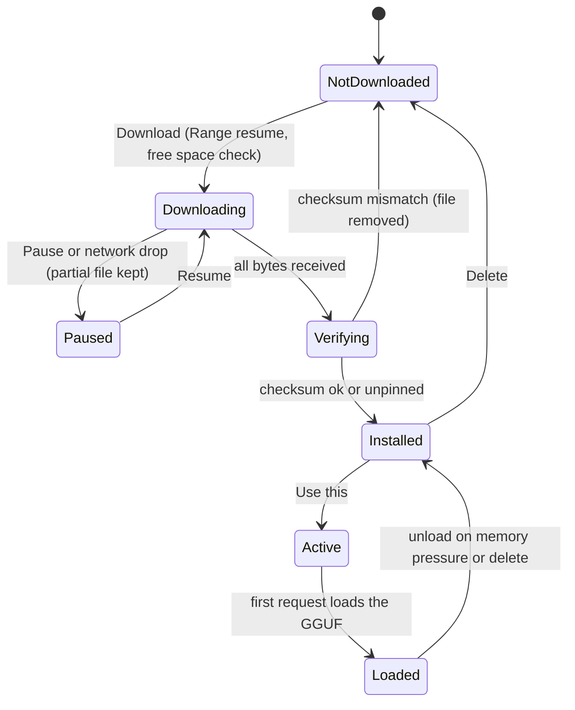

Models are never bundled. The registry lists small GGUF models with size, RAM need, licence and chat template. The engine loads a model lazily on the first request and keeps one loaded. Tool use is emulated with a small JSON protocol checked against each tool's schema, with repair attempts; JSON output uses grammar-constrained decoding when the engine supports it.

## 14. Not verified / needs a device

The build sandbox has no Android SDK, no Docker daemon and a restricted network, so these are covered by tests with fakes or by reading only, and need a check on a real phone or network.

- Kotlin native modules: `bacchat-dynamic-color`, `bacchat-sms` (receiver, headless service, notifier), `bacchat-share`, `bacchat-ocr` (ML Kit). Their TypeScript sides are tested with fakes; the Kotlin has never been compiled or run here.
- `bacchat-llm` over `llama.rn`: loading a GGUF, grammar-constrained JSON, memory behaviour on a low-RAM phone. Model URLs and checksums in the registry are not pinned.
- Config plugins (`withShareIntent`, `withShortcuts`, `withHardenedManifest`, `withGoogleOAuthRedirect`, `withNotificationIcon`) have unit tests on their output but no prebuild was run.
- Google Drive sync and sign-in (needs a real OAuth client id in `app.json` extra), and the WebDAV and S3 targets against real servers (tests use recorded fakes).
- Live NAV sources: the AMFI `NAVAll.txt` parser follows the documented layout and the NPS URL and format are unconfirmed (set `npsNavUrl` if the default is wrong).
- SQLCipher with the Keystore-held key on a device, and the biometric prompt.
- The backend Docker image (`docker build`, compose, HEALTHCHECK) has not been built here; run `DEMO_URL=... npm run demo` against a running container.
- Material Symbols Rounded weight 300: the app currently draws category glyphs from `@expo/vector-icons` MaterialIcons plus the 25 custom icons (see design-system.md).
