# Architecture

How Bacchat is put together. Items marked "planned" are intended design and may change as the code lands; see [decisions.md](decisions.md) for the reasoning and [backend.md](backend.md) for the sync service.

## 1. System context

Everything runs on the phone by default. The only network traffic is anonymous public NAV fetches, optional encrypted sync, and optional calls to the user's own AI provider.

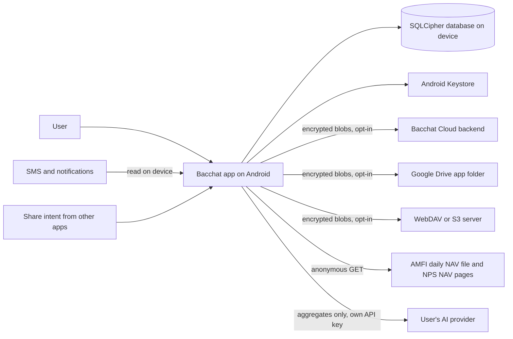

## 2. Frontend layering

Dependencies point downward only. Screens never touch the database or native modules directly.

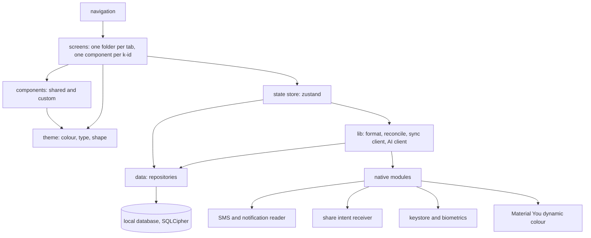

Folder map (planned, matches CLAUDE.md): `frontend/src/theme`, `components`, `screens`, `navigation`, `data`, `lib`.

## 3. Theming pipeline

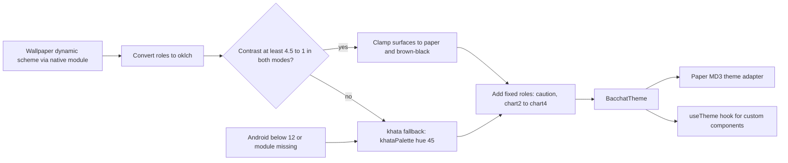

- `oklch.ts` converts oklch to sRGB hex. Screens never hold hex values; they read roles from the hook.
- The Paper adapter maps BacchatTheme roles onto react-native-paper's `MD3Theme` so standard components inherit Khata colours, fonts and shapes.
- The check runs on every scheme change (wallpaper change, light or dark switch).

## 4. Navigation structure

Bottom tabs hold a native stack each. The tab bar is visible only on the five tab roots. Sheets and dialogs are modal routes over their parent. The full route table is in [screens.md](screens.md).

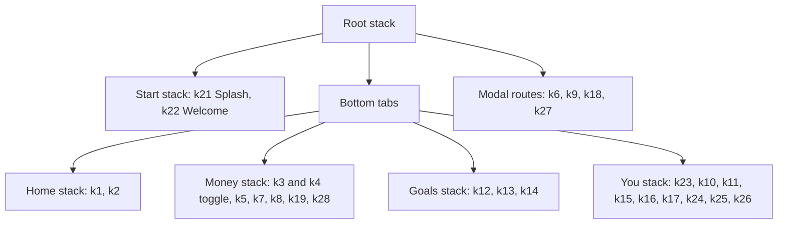

Deep links (planned): share image to k7, "From SMS" notification to k4 filtered to To review, launcher shortcut to k5.

## 5. Data model

Money is integer paise. Every table carries `id`, `updatedAt`, `deletedAt` (tombstone, used by sync). Field lists are planned.

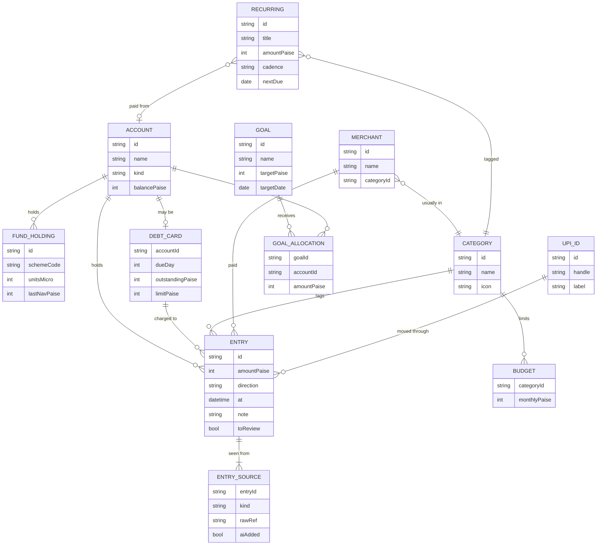

`ENTRY_SOURCE.kind` is one of SMS, Email, Screenshot, By hand. An entry matched by a second source gains another row here rather than a duplicate entry. Screenshots themselves stay on the device and do not sync by default.

## 6. Reconciliation (screenshot import)

A screenshot is read with on-device OCR (k7), parsed into candidate rows, then each row is compared with entries on the same day. Rule: amount (exact) + time (within 10 minutes) + merchant (fuzzy).

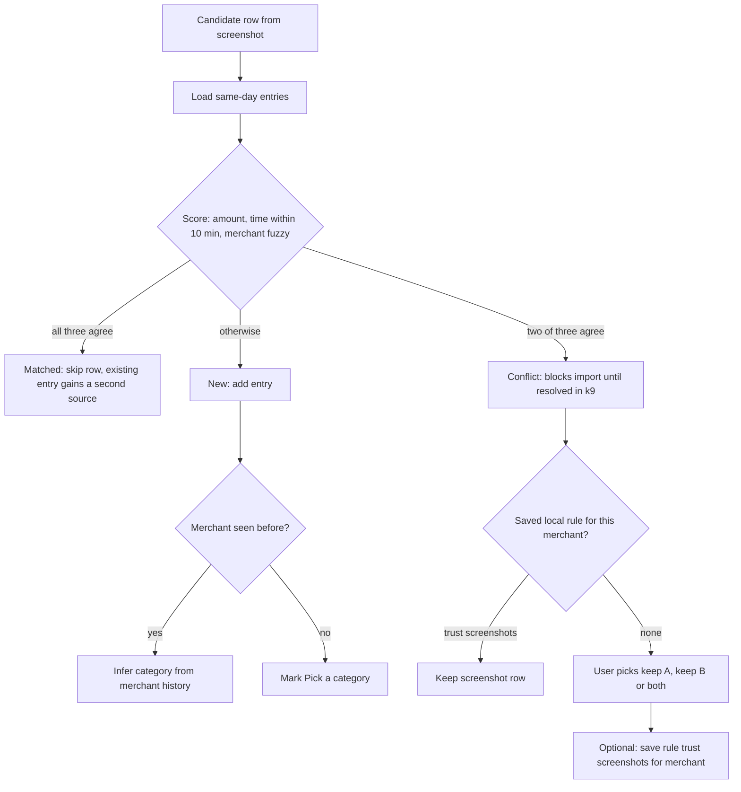

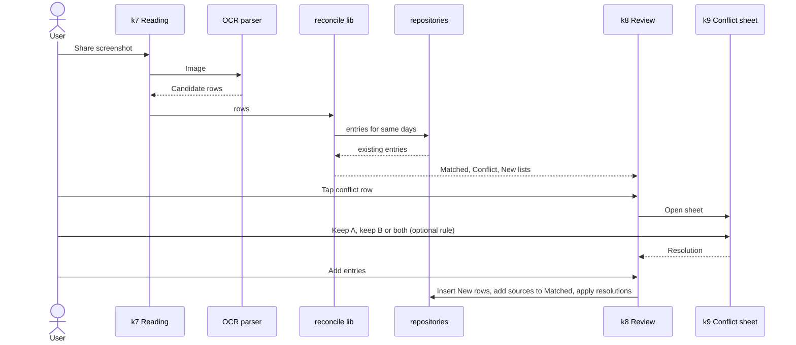

The reconcile function is pure (rows and entries in, classification out) so it is unit tested without UI. Thresholds are constants in one file.

## 7. SMS and email AI ingestion

Reading happens on the device. The default parser is rule-based; the user's own AI model is used only if they enable it, and then only the message text needed to extract a transaction is sent (planned, opt-in).

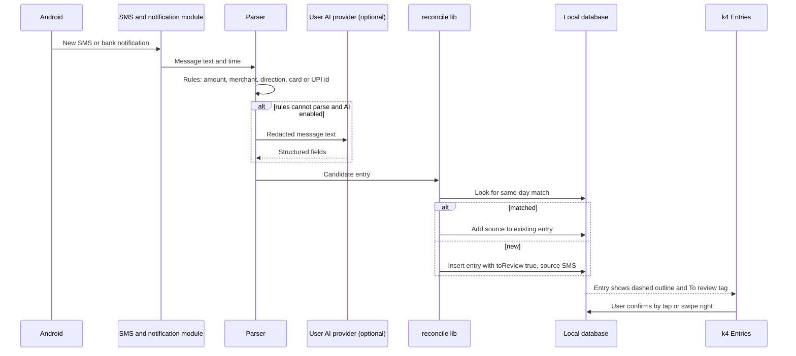

Rules: AI-added entries are flagged until confirmed. A notification "From SMS" deep links to k4 filtered to To review. The reader needs the SMS or notification-listener permission; without it the rest of the app works.

## 8. AI advisor

The advisor is an MCP-style client inside the app. Tools are read-only functions over local data that return aggregates.

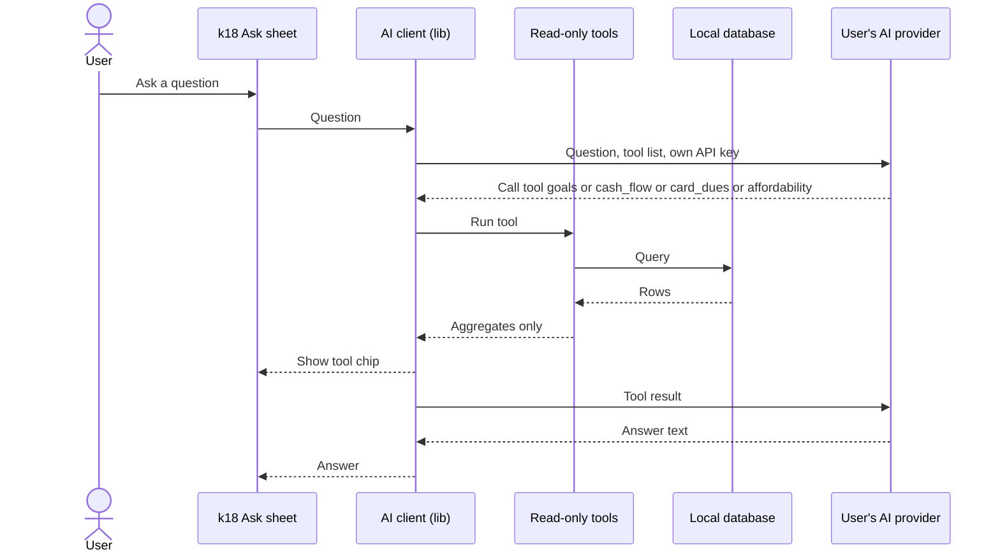

- Tools are read-only; there is no tool that writes or deletes.
- Only aggregates leave the device (totals, counts, dates). No raw SMS text, account names or UPI handles. The sheet says so.
- The API key is stored in the Keystore-backed secure store, never in the database or sync blobs.
- Opened from the Ask pill, an Ask row in You, and insight cards. Always a bottom sheet, never a takeover.

## 9. Sync

Sync is off by default. The client derives a key from a passphrase, encrypts each blob locally, and exchanges it with a server that cannot read it. Blob names are opaque (planned: one blob per table snapshot or per change batch).

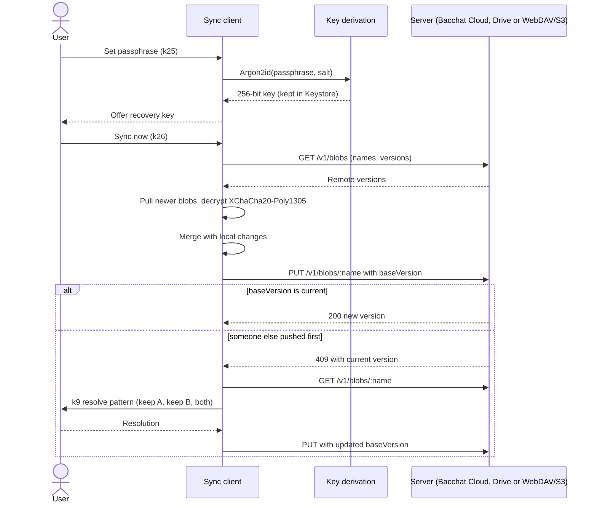

- Nonce: 24 random bytes per blob (XChaCha20 permits random nonces). Blob name is bound as associated data.
- Last-writer-wins is not used for conflicting rows; the user resolves them with the k9 pattern.
- Screenshots are excluded unless the user turns them on.

## 10. Security model

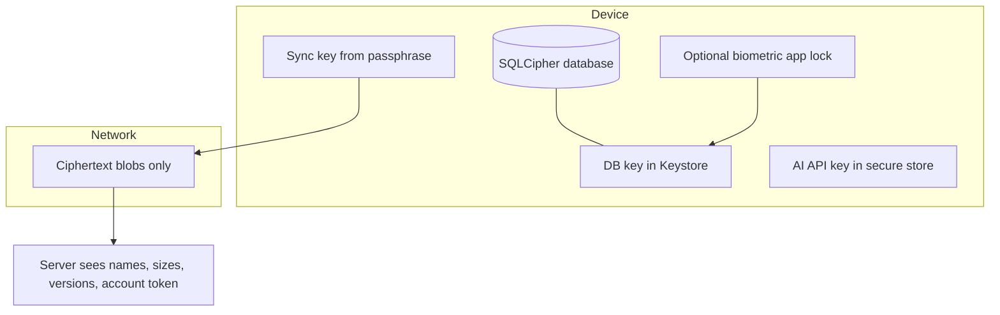

| Asset | Protection |
|---|---|
| Local data | SQLCipher at rest; key in Android Keystore; optional biometric lock |
| Sync data | Encrypted on device before upload; server never has the key |
| Passphrase | Never leaves the device; Argon2id stretches it; recovery key offered |
| AI key | Secure store; sent only to the chosen provider |
| Account on server | Random token from register; stored as a hash on the server |
| Public fetches | Anonymous; no identifiers sent |

Out of scope: a rooted or compromised phone, and weak passphrases chosen by the user (the UI nudges toward the recovery key). See [backend.md](backend.md) for the server threat model.

## 11. Deployment

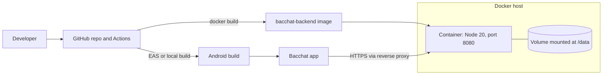

TLS is terminated by a reverse proxy in front of the container (planned guidance in backend.md). The app can point at any compatible host, so self-hosting is first class.

## 12. Performance and offline notes

- Offline first: every screen works with no network. Network failures only affect NAV refresh, AI and sync, and each shows a calm inline state.
- Lists use `FlatList` or FlashList with fixed row heights (56-60) so Entries scales to tens of thousands of rows. Summaries are computed by SQL aggregates, not in JS loops.
- Index entries on `(at)`, `(accountId, at)` and `(categoryId, at)` (planned).
- Charts are small SVG components; scrubbing updates a shared value so no full re-render per frame. Skia only where SVG is too slow.
- SQLCipher open and key derivation happen behind the splash (k21); first paint uses cached Home data.
- NAV refresh is once a day in the background, cached, and skipped on metered or offline connections.
- Sync pushes only changed blobs and compresses before encrypting. Compressing after encryption is useless, so order matters.
- Fonts (Young Serif, Figtree) load before the splash hides; fallback to system serif and sans if they fail.
- Font scale to 200% and reduce motion are honoured; animations use the native driver or Reanimated worklets.
