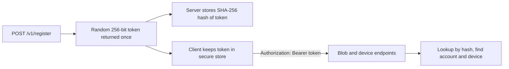
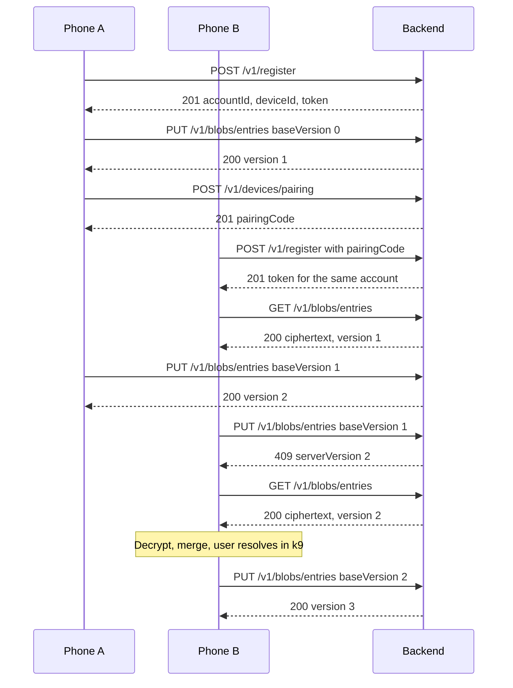

# Backend (Bacchat Cloud)

The service in `backend/` is implemented and tested (37 tests plus a 45-check demo). The code and `backend/README.md` are the final word; update this page when they differ.

## Purpose

A small sync service that stores client-side-encrypted blobs for the Bacchat app. It never sees plaintext, keys or passphrases. It is deployable on its own with Docker, so anyone can self-host it. The app can also sync to Google Drive, WebDAV or S3; this service is the default option.

Stack: Node 20, TypeScript, Fastify 5, zod for validation, SQLite (better-sqlite3, WAL mode) for both metadata and blob bytes. Storage sits behind a `Store` interface (`src/store/types.ts`) with SQLite (production) and in-memory (tests) implementations.

```
backend/
  src/server.ts       entry: config, store, listen, graceful shutdown
  src/app.ts          routes, auth, error handling, security headers
  src/config.ts       environment variables
  src/schemas.ts      zod request schemas, base64 and nonce checks
  src/rateLimit.ts    fixed-window in-memory limiter
  src/store/          types.ts, sqlite.ts, memory.ts
  test/               api.test.ts, units.test.ts (vitest)
  demo/demo.ts        end-to-end walkthrough with PASS/FAIL output
  Dockerfile, docker-compose.yml
```

## API reference

Base path `/v1`. Requests and responses are JSON; blob `ciphertext` and `nonce` are standard base64 strings (not raw octets). Errors are `{ "error": "code", "message": "text" }` plus extra fields where noted. Authenticated routes need `Authorization: Bearer <token>`.

| Method and path | Auth | Body | Success | Errors |
|---|---|---|---|---|
| `GET /healthz` | none | | 200 `{ "status": "ok" }` | |
| `POST /v1/register` | none | `{ deviceName, pairingCode? }` | 201 `{ accountId, deviceId, token }` | 400, 403 `invalid_pairing_code`, 409 `device_limit`, 429 |
| `POST /v1/devices/pairing` | bearer | none | 201 `{ pairingCode, expiresAt }` (single use, 10 minutes, hash stored) | 401 |
| `PUT /v1/blobs/:name` | bearer | `{ baseVersion, ciphertext, nonce, meta? }` | 200 `{ version, updatedAt }` | 400, 401, 409 `version_conflict` `{ serverVersion, serverUpdatedAt }`, 413 `blob_too_large` or `storage_cap_exceeded` `{ capBytes, usedBytes }` |
| `GET /v1/blobs/:name` | bearer | | 200 `{ version, ciphertext, nonce, meta, updatedAt, deviceId }` | 401, 404 |
| `GET /v1/blobs` | bearer | | 200 `{ blobs: [{ name, version, updatedAt, size }], usedBytes, capBytes }` | 401 |
| `GET /v1/devices` | bearer | | 200 `{ devices: [{ id, name, createdAt, lastSeenAt, current }] }` | 401 |
| `DELETE /v1/devices/:id` | bearer | | 204 | 401, 404 |
| `DELETE /v1/account` | bearer | | 204 (erases all devices and blobs) | 401 |

Notes:
- `:name` matches `[A-Za-z0-9._-]{1,64}`. The server cannot tell what a blob holds. The app uses `keyring`, `entries`, `accounts`, `goals`, `categories`, `budgets`, `rules`, `screenshots`, `asks` and `shot-<id>`.
- Concurrency is optimistic: send the version you last pulled as `baseVersion` (0 to create). A different server version returns 409 with `serverVersion`. Versions are server-assigned integers that increase by one per accepted write.
- `nonce` must decode to exactly 24 bytes (XChaCha20-Poly1305). `ciphertext` must be strict base64 and at most `MAX_BLOB_BYTES` after decoding (default 10 MB). A request body over the derived size limit also gets 413 `payload_too_large`.
- `meta` is an optional JSON object of at most 4 KB. It is stored unencrypted, so clients keep it free of anything sensitive.
- Both the per-blob limit and the per-account storage cap return 413, not 507.
- Every response carries security headers (`nosniff`, `X-Frame-Options: DENY`, `Referrer-Policy: no-referrer`, `Cache-Control: no-store`, a restrictive CSP, HSTS). CORS is off.

## Auth model



- No email, name or password. The token is the account credential. Losing every device token means the account is unreachable; the encrypted data remains recoverable only with the passphrase or recovery key plus a new account upload.
- Each device has its own token so one device can be revoked without touching the others. Revoking deletes the device row, so its token stops working at once.
- Adding a device: a signed-in phone calls `POST /v1/devices/pairing` and shows the code; the new phone sends it as `pairingCode` to `POST /v1/register` and gets its own token on the same account. Codes are random, stored as SHA-256 hashes, single use, and expire after 10 minutes. `MAX_DEVICES_PER_ACCOUNT` caps devices (409 `device_limit`).
- The token is not the encryption key. Sync keys come from the user's passphrase and never reach the server.
- Registration is limited per client IP (`REGISTER_LIMIT_PER_HOUR`, default 10). All routes except `/healthz` share a per-IP request limit (`RATE_LIMIT_PER_MIN`, default 120). Both answer 429 with `Retry-After`; set a limit to 0 to disable it. There is no flag to close registration; restrict access at the proxy for private hosts.

## Storage and cap

- One SQLite file, `DATA_DIR/bacchat.db` (WAL mode, foreign keys on), holds `accounts`, `devices` (token hashes), `pairing_codes` (code hashes) and `blobs`. Blob bytes (ciphertext and nonce) are stored in the `blobs` table, one row per account and name holding only the latest version.
- Writes are atomic: a put checks `baseVersion`, the account's used bytes against the cap, and replaces the row in one transaction.
- Per-account cap: `STORAGE_CAP_BYTES`, default 500 MB (524288000), counted over ciphertext plus nonce. Exceeding it returns 413 `storage_cap_exceeded`. It is a per-account value, not a global disk limit.
- Per-blob limit: `MAX_BLOB_BYTES`, default 10 MB (10485760), over decoded ciphertext. Exceeding it returns 413 `blob_too_large`.
- Single instance only: the database is a local file and rate limits live in memory.

## Configuration

| Variable | Default | Meaning |
|---|---|---|
| `PORT` | `8080` | HTTP port |
| `HOST` | `0.0.0.0` | Listen address |
| `DATA_DIR` | `/data` | Directory for `bacchat.db` (mount a volume here) |
| `STORAGE_CAP_BYTES` | `524288000` | Per-account storage cap (500 MB) |
| `MAX_BLOB_BYTES` | `10485760` | Largest single blob (10 MB) |
| `MAX_DEVICES_PER_ACCOUNT` | `20` | Device limit when pairing |
| `RATE_LIMIT_PER_MIN` | `120` | Requests per minute per client IP (0 disables) |
| `REGISTER_LIMIT_PER_HOUR` | `10` | Registrations per hour per client IP (0 disables) |
| `TRUST_PROXY` | `false` | Trust `X-Forwarded-For`; set `true` only behind your own reverse proxy so limits see the real IP |
| `LOG_LEVEL` | `info` | Fastify log level. Logs record method, path (no query) and status; never headers, tokens or bodies |

Values must be non-negative integers; anything else stops the server at start.

## Docker

Build and run (commands from CLAUDE.md):

```
cd backend
docker build -t bacchat-backend .
docker run -p 8080:8080 -v bacchat-data:/data bacchat-backend
```

Or `docker compose up --build` (file `backend/docker-compose.yml`): service `bacchat-cloud`, port 8080, named volume `bacchat-data` at `/data`, and the variables above passed through with defaults (`STORAGE_CAP_BYTES`, `MAX_BLOB_BYTES`, `RATE_LIMIT_PER_MIN`, `REGISTER_LIMIT_PER_HOUR`, `TRUST_PROXY`, `LOG_LEVEL`), `restart: unless-stopped`.

The image is multi-stage on `node:20-slim` (build with dev dependencies and a compiler for better-sqlite3 if no prebuilt binary matches, run with production dependencies only), runs as the non-root `node` user (uid 1000, so the volume must be writable by it) and has a `HEALTHCHECK` that fetches `/healthz`. The Docker build has not been run in the development sandbox (no daemon); see [testing.md](testing.md).

## Self-hosting and backup

- Put a TLS reverse proxy (Caddy, nginx, Traefik) in front and set `TRUST_PROXY=true`. The service speaks plain HTTP; do not expose it to the internet directly, since tokens travel in a header. The app accepts http or https URLs, so use https.
- Back up the `/data` volume. SQLite runs in WAL mode, so copy `bacchat.db`, `bacchat.db-wal` and `bacchat.db-shm` together, or use `sqlite3 bacchat.db ".backup file"`. Restore by mounting the copy at `/data`.
- Because blobs are encrypted by the client, backups are safe to store off-site; they are useless without the user's passphrase or recovery key.
- Point the app at your host in Settings (k24, server section) or when setting up Backup and sync (k25).

## Threat model

| Threat | Mitigation |
|---|---|
| Server operator reads data | Blobs are XChaCha20-Poly1305 ciphertext; keys never uploaded |
| Stolen backup of the volume | Same: ciphertext only; token hashes are not usable as tokens |
| Stolen device token | Revoke it via `DELETE /v1/devices/:id` from another device; data stays encrypted |
| Token guessing | 256-bit random tokens, stored only as SHA-256 hashes; per-IP request rate limit |
| Pairing code guessing | 128-bit random single-use codes, 10 minute expiry, registration rate limit |
| Disk fill by one account | Per-account cap and per-blob limit (both 413), device limit, body size limit |
| Rollback or replay of an old blob | Versions only increase; clients bind the blob name as AEAD associated data, track the last seen version and stop on a rollback |
| Metadata leakage | Server sees blob names, sizes, timing, device names and IP. Names are opaque; use a proxy or VPN if timing matters |
| Lost passphrase | Not recoverable by the server; the recovery key offered at setup is the only way |

## Sequence: register, push, conflict



## Demo

`npm run demo` exercises every endpoint and limit and prints PASS or FAIL per check. Set `DEMO_URL` to point it at a running server or container. See [testing.md](testing.md).
