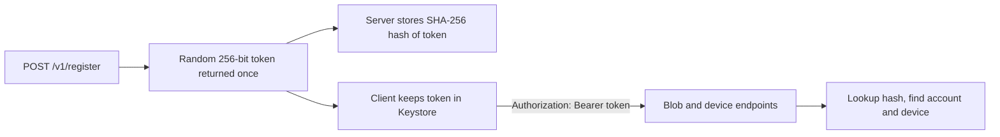
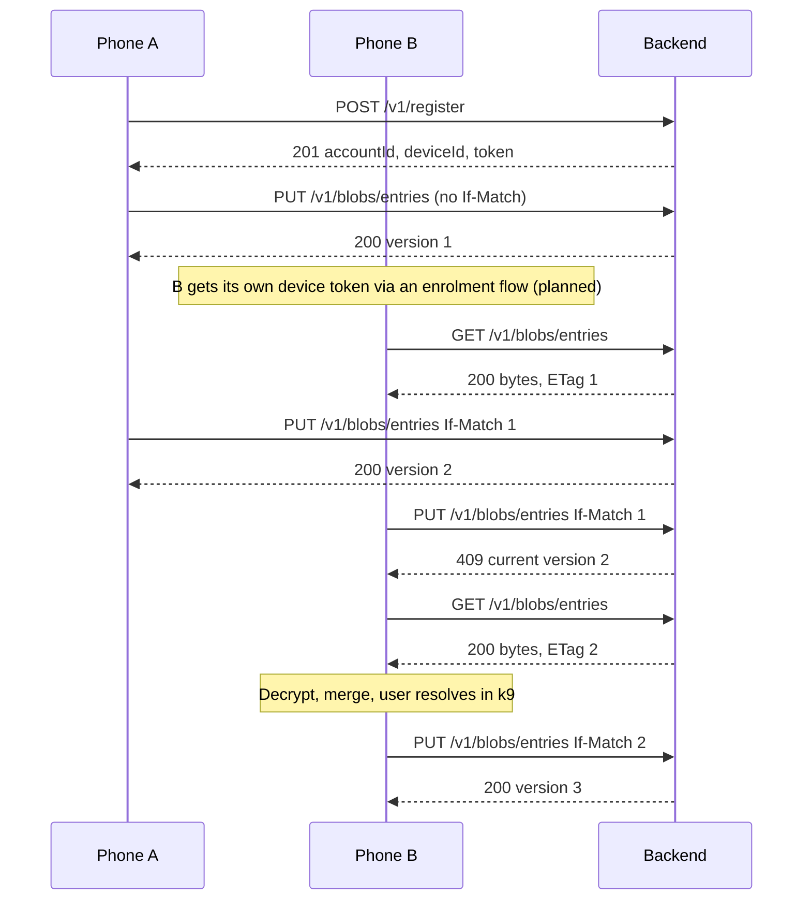

# Backend (Bacchat Cloud)

All endpoints, limits and variables below are planned and may change as `backend/` lands. The code and its tests are the final word; update this page when they differ.

## Purpose

A small sync service that stores client-side-encrypted blobs for the Bacchat app. It never sees plaintext, keys or passphrases. It is deployable on its own with Docker, so anyone can self-host it. The app can also sync to Google Drive or WebDAV/S3; this service is the default option.

Stack: Node 20, TypeScript, a Fastify-style REST server, SQLite for metadata, blob bytes on the data volume.

## API reference (planned)

Base path `/v1`. Bodies for blobs are raw `application/octet-stream`. Errors are JSON `{ "error": "code", "message": "text" }`.

| Method and path | Auth | Purpose | Success | Errors |
|---|---|---|---|---|
| `GET /healthz` | none | Liveness and version | 200 `{ "ok": true }` | |
| `POST /v1/register` | none | Create an account and first device; returns token | 201 `{ "accountId", "deviceId", "token" }` | 429 rate limited, 507 server full |
| `PUT /v1/blobs/:name` | bearer | Upload a blob. Header `If-Match: <baseVersion>` (0 or absent for new) | 200 `{ "version" }` | 409 version conflict (returns current version), 413 over `MAX_BLOB_BYTES`, 507 over storage cap |
| `GET /v1/blobs/:name` | bearer | Download a blob; `ETag` is its version | 200 bytes | 404 |
| `GET /v1/blobs` | bearer | List blob names, versions, sizes, updated time | 200 JSON list | |
| `POST /v1/devices/pairing` | bearer | Create a single-use pairing code (10 minutes, hash stored) that a new device passes to register as `pairingCode` | 201 JSON | |
| `GET /v1/devices` | bearer | List devices on the account | 200 JSON list | |
| `DELETE /v1/devices/:id` | bearer | Revoke a device token | 204 | 404 |
| `DELETE /v1/account` | bearer | Delete the account and every blob | 204 | |

Notes:
- `:name` is an opaque string chosen by the client (letters, digits, `-`, `_`, up to 128 chars). The server cannot tell what a blob holds.
- Versions are server-assigned integers that increase by one per accepted write.
- `DELETE /v1/devices` is listed as a family in the plan; the per-id form above is the intended shape.

## Auth model



- No email, name or password. The token is the account credential. Losing every device token means the account is unreachable; the encrypted data remains recoverable only with the passphrase plus a new account upload.
- Each device has its own token so one device can be revoked without touching the others.
- The token is not the encryption key. Sync keys come from the user's passphrase and never reach the server.
- Registration is rate limited per IP (planned) and can be closed with an env flag on private hosts (planned).

## Storage and cap

- Metadata in SQLite at `DATA_DIR/meta.db`: accounts, devices (token hashes), blob index (name, version, size, updatedAt).
- Blob bytes at `DATA_DIR/blobs/<accountId>/<name>.<version>`; older versions are removed once the new one is committed.
- Storage cap per account: `STORAGE_CAP_BYTES`, default 500 MB (524288000). Writes that would exceed it return 507. The cap is a per-account value, not a global disk limit.
- Per-blob limit: `MAX_BLOB_BYTES`. Planned default 20 MB.
- Writes go to a temp file, then are renamed, then metadata is updated in a transaction.

## Configuration

| Variable | Default | Meaning |
|---|---|---|
| `PORT` | `8080` | HTTP port inside the container |
| `DATA_DIR` | `/data` | Where SQLite and blobs live (mount a volume here) |
| `STORAGE_CAP_BYTES` | `524288000` | Per-account storage cap (500 MB) |
| `MAX_BLOB_BYTES` | `20971520` (planned) | Largest single blob |

## Docker

Build and run (commands from CLAUDE.md):

```
cd backend
docker build -t bacchat-backend .
docker run -p 8080:8080 -v bacchat-data:/data bacchat-backend
```

Compose (planned file `backend/docker-compose.yml`):

```
services:
  bacchat:
    build: .
    ports: ["8080:8080"]
    environment:
      PORT: "8080"
      DATA_DIR: /data
      STORAGE_CAP_BYTES: "524288000"
      MAX_BLOB_BYTES: "20971520"
    volumes:
      - bacchat-data:/data
    restart: unless-stopped
volumes:
  bacchat-data:
```

Run with `docker compose up --build`. The image is multi-stage (build with dev dependencies, run with production dependencies only), runs as a non-root user, and has a `HEALTHCHECK` on `/healthz` (planned).

## Self-hosting and backup

- Put a TLS reverse proxy (Caddy, nginx, Traefik) in front. Do not expose plain HTTP to the internet; tokens travel in a header.
- Back up the whole `/data` volume while the container is stopped, or use SQLite's online backup for `meta.db` plus a copy of `blobs/`. Restore by mounting the copy at `/data`.
- Because blobs are encrypted by the client, backups are safe to store off-site; they are useless without the user's passphrase.
- Point the app at your host in Backup and sync (k25) settings (planned field: server URL).

## Threat model

| Threat | Mitigation |
|---|---|
| Server operator reads data | Blobs are XChaCha20-Poly1305 ciphertext; keys never uploaded |
| Stolen backup of the volume | Same: ciphertext only; token hashes are not usable as tokens |
| Stolen device token | Revoke it via `DELETE /v1/devices/:id` from another device; data stays encrypted |
| Token guessing | 256-bit random tokens; constant-time hash compare; rate limits on failures (planned) |
| Disk fill by one account | Per-account cap and per-blob limit; 507 and 413 responses |
| Rollback or replay of an old blob | Versions only increase; clients bind blob name as AEAD associated data and track last seen version |
| Metadata leakage | Server sees blob names, sizes, timing and IP. Names are opaque; use a proxy or VPN if timing matters |
| Lost passphrase | Not recoverable by the server; the recovery key offered at setup is the only way |

## Sequence: register, push, conflict



Device enrolment is implemented: Phone A calls `POST /v1/devices/pairing` and shows the code or QR, Phone B sends it as `pairingCode` to `POST /v1/register` and receives a token for the existing account. Other implemented details: nonce must decode to 24 bytes, blob names match `[A-Za-z0-9._-]{1,64}`, `meta` is capped at 4 KB, MAX_BLOB_BYTES defaults to 10 MB.

## Demo

`npm run demo` exercises every endpoint and limit and prints PASS or FAIL per check. Set `DEMO_URL` to point it at a running server or container. See [testing.md](testing.md).
