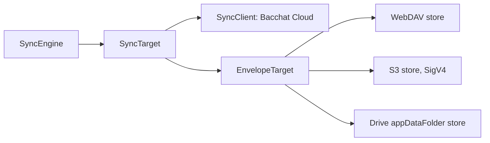

# Decisions

ADR-style log. New entries go at the end with the next number. Do not rewrite history; to change a decision, add a new entry that supersedes it and update the old Status.

Status values: Accepted, Proposed (needs confirmation), Superseded.

## 1. React Native instead of Kotlin and Compose

- Status: Accepted (user decision)
- Context: The design document was written for Kotlin and Jetpack Compose. The owner chose a TypeScript stack so one codebase, familiar tooling and a shared language with the backend are possible.
- Decision: Build the app in React Native with TypeScript. Get Material 3 through `react-native-paper` v5, themed with our own scheme. Android first; iOS is not blocked but not targeted.
- Consequences: The design's Compose component names map to Paper or custom components (see CLAUDE.md inventory). Material You needs a native module (decision 7). Android-only features need native modules (SMS, share intent). DataStore in the design becomes a key-value store.

## 2. Expo development builds

- Status: Proposed
- Context: We need native modules, so Expo Go is not enough, but we want Expo's tooling, config plugins and EAS builds.
- Decision: Use Expo with development builds (`expo run:android`, `expo prebuild`) and config plugins for native pieces.
- Consequences: Faster setup and upgrades than bare React Native. Native code is generated, so custom changes go through config plugins or local modules. Needs the Android SDK to run.

## 3. Monorepo with separate frontend and backend

- Status: Accepted
- Context: The app and the sync service evolve together but must be deployable independently.
- Decision: One repo with `frontend/` and `backend/`, each with its own `package.json`, lockfile, tsconfig and build files. No shared workspace tooling at first.
- Consequences: Independent per-folder builds and a self-contained backend Docker context. Shared types (API shapes) are duplicated or copied until a shared package is justified.

## 4. Node and TypeScript backend with Docker

- Status: Proposed
- Context: The design needs a store for encrypted blobs and leaves hosting open (open question 2). Anyone should be able to self-host.
- Decision: Node 20 and TypeScript, a Fastify-style REST API, SQLite for metadata, blobs on a data volume, shipped as a Docker image with a compose file. Per-account cap 500 MB by default.
- Consequences: Same language as the app and a tiny runtime footprint. SQLite limits horizontal scaling, which is acceptable for a personal-scale service. Hosting and free-tier policy remain open.

## 5. Palette ported from the design generator, oklch converted in-app

- Status: Accepted
- Context: The design defines colours in oklch through `khataPalette(hue, mode)`. Hand-copied hex values would drift and block dynamic hue changes.
- Decision: Port the generator exactly into `frontend/src/theme` and convert oklch to sRGB in `oklch.ts`, tested against the hex values in design-system.md.
- Consequences: One source of truth; a seed hue change regenerates everything. Needs conversion tests and gamut clipping rules. Screens must read roles from the theme hook only.

## 6. Money as integer paise

- Status: Accepted
- Context: Floating point errors are unacceptable for money.
- Decision: Store and compute all amounts as integer paise. Format only at the edge through `lib/format`. Fund units use an integer micro-unit representation (planned).
- Consequences: Parsing and rounding are explicit and testable. Percentages and averages need a defined rounding rule (half up, planned). Large values stay within safe integer range for personal finance.

## 7. Dynamic colour through a native module with warm fallback

- Status: Proposed
- Context: Material You wallpaper colours are an Android 12+ feature that React Native does not expose. Wallpaper schemes can fail contrast.
- Decision: Read the dynamic scheme through a native module (for example `@pchmn/expo-material3-theme`), clamp surfaces to paper and brown-black, check contrast at runtime, and fall back to `khataPalette(45, mode)` on failure or on Android below 12.
- Consequences: The app always has a valid, accessible theme. A dependency on a third-party module (or a small local one) is accepted. Needs a device to verify.

## 8. k-id naming for screens

- Status: Accepted
- Context: The design identifies screens by ids (k1 to k29). Using them in code keeps design, tests and docs aligned.
- Decision: Each screen component, test and route table row carries its k-id. Folders are named by tab; files by k-id and name.
- Consequences: Easy traceability with screens.md. Names are less self-explanatory without the table, so each file has a header comment.

## 9. ASCII-only text rule

- Status: Accepted
- Context: Em dashes, curly quotes, arrows and emojis cause diff noise, encoding bugs and inconsistent rendering.
- Decision: All code, comments, docs and commit messages are plain ASCII. UI copy such as the rupee sign lives in i18n resources and sample data; in source write the rupee sign as a backslash-u-20B9 escape. Docs write "Rs".
- Consequences: A grep check can enforce it. Authors must retype pasted text.

## 10. SQLCipher local database

- Status: Proposed
- Context: The design specifies an encrypted local database with a key in the Android Keystore. It was Room on Android.
- Decision: Use SQLite with SQLCipher (for example `op-sqlite` or `expo-sqlite` with SQLCipher). Random database key stored through the Keystore-backed secure store; optional biometric app lock.
- Consequences: Data at rest is encrypted. Native dependency choice is still open. Migrations are hand-written SQL, versioned.

## 11. Sync crypto choices

- Status: Accepted (algorithms from the design); parameters planned
- Context: Sync must be end-to-end encrypted, work with an untrusted or self-hosted server, and survive device loss.
- Decision: Derive the key with Argon2id from the user's passphrase and a random salt. Encrypt each blob with XChaCha20-Poly1305 using a random 24 byte nonce and the blob name as associated data. Use libsodium bindings. Offer a recovery key at setup. Use optimistic concurrency with `baseVersion`; a 409 leads to the k9 resolve pattern.
- Consequences: The server cannot read data and cannot recover a lost passphrase. Argon2id cost parameters must suit low-end phones (tune and record here). Key rotation and passphrase change need a re-encrypt pass (planned).

## 12. Key-value storage and persisted stores

- Status: Accepted
- Context: Home order, first run, Money segment, goals, budget and preferences must survive restarts.
- Decision: AsyncStorage behind `src/lib/storage.ts`, zustand `persist` for stores, a hydration gate in App.tsx, theme in `usePreferences`.
- Consequences: Simple and testable with an in-memory implementation. Heavier data lives in the database layer instead.

## 13. Database layer: JSON columns and micro-unit NAVs

- Status: Accepted
- Context: Entities change often while the design is young, and fund NAVs have four decimals.
- Decision: Each table stores the record as JSON plus a few indexed columns, with versioned migrations (`PRAGMA user_version`). Fund units are micro-units and NAVs micro-rupees (`lastNavMicro`) so valuation is exact; this replaces `lastNavPaise` in the ER diagram. Card names are sent to the AI advisor as "Card 1", "Card 2". `sql.js` is a dev-only dependency so the same repository tests run against the memory and SQLite implementations.
- Consequences: New optional fields need no migration. Derived queries are pure functions over `entries.between` and can move to SQL aggregates later.

## 14. Sync client design

- Status: Accepted
- Context: The server must never see plaintext or the passphrase.
- Decision: A random master key is wrapped by an Argon2id passphrase key and by a recovery key and stored as a public `keyring` blob. Blobs use XChaCha20-Poly1305 with a version byte and associated data binding the blob name. Merge is three-way per row against the last synced snapshot; conflicts surface as objects the k9 sheet renders.
- Consequences: Changing the passphrase re-wraps the key and never re-encrypts data. The backend returns 413 (not 507) for the storage cap.

## 15. App services layer

- Status: Accepted
- Context: Screens need one place to get the database, clock, secrets and the sync and advisor clients.
- Decision: `src/services` holds an AppServicesProvider (renders nothing until the db is open and seeded). The db key is a random 256-bit hex string kept in the secure store (expo-secure-store, memory fallback). Repositories are wrapped so every write emits a change, which useDbQuery listens to. "Today" is the design's sample day while the seeded sample is in use and the real clock otherwise. Secrets (API key, model, sync token, master key) live in the secure store; switches and the NAV day guard live in usePreferences. Sync rows map to repositories with ISO timestamps; accounts, goals sets also carry debts, holdings, UPI ids, allocations and recurring rows with table-prefixed ids. Pulled rows keep their remote timestamps through an applied-stamp map in key-value storage so they are not echoed back.
- Consequences: SQLCipher still needs the expo-sqlite config plugin option in a dev build. The sync libsodium binding is chosen in `services/sodium.ts` (WASM today; react-native-libsodium for release). The random source is `crypto.getRandomValues`; without one the db falls back to memory.

## 16. Android entry points: SMS, share, shortcut, and the Play Store SMS policy

- Status: Accepted (SMS reading needs a Play declaration before a store release)
- Context: CLAUDE.md asks for SMS reading, a "From SMS" notification, share-intent receiving and a launcher shortcut. Google Play restricts READ_SMS and RECEIVE_SMS to apps that are the default SMS handler, or that qualify for a permitted-use exception through the Permissions Declaration Form. A personal finance app that reads bank texts to add transactions is not a default SMS app, and Play reviews such declarations case by case; apps can be rejected or removed.
- Decision: Two thin local Expo modules hold only native glue: `modules/bacchat-sms` (permissions, bounded inbox read, manifest BroadcastReceiver with an app-private queue, local notification on channel "entries") and `modules/bacchat-share` (shared image URIs, copied to the app cache). All logic lives in TypeScript: `src/services/ingestService.ts` (parseSms, ingestCandidate, dedupe by rawRef, minConfidence, To review tagging, conflicts kept in a pending list and never auto-inserted, one backfill of the last 30 days on first enable), `shareService.ts` and `emailSource.ts`. App config is in config plugins: `plugins/withShareIntent.js` (SEND and SEND_MULTIPLE image/* on MainActivity) and `plugins/withShortcuts.js` (static "Add entry" shortcut firing bacchat://add), plus the three permissions in app.json. The receiver does nothing while the Settings switch is off, and turning it off clears the queue. Nothing is logged or uploaded.
- Fallback that must always work: user-initiated import. "Paste a message" (k4 empty state and the SMS row in k24) takes pasted bank SMS or email text through parseSms or parseEmail and tags the result To review; sharing a screenshot into Bacchat opens k7. A build without the SMS permissions (for example a Play build that was not granted the declaration) can drop READ_SMS and RECEIVE_SMS from app.json and still ships both paths. The Settings row then explains that reading is unavailable and offers paste.
- Email: reading a mailbox needs a mail provider integration (Gmail API with OAuth, or IMAP with an app password) and is not part of this round. `EmailSource` in `emailSource.ts` is the interface that integration will implement; today only the manual paste path exists.
- Open: messages that arrive while the app is closed are queued and processed on next launch (no background JS task yet), so the notification for them appears then. Listening for UPI app notifications (notification-listener access) is out of scope. Identical texts from one sender on the same day are treated as the same message.
- Consequences: Kotlin could not be compiled in the sandbox (no Android SDK); the first dev build on a real device is the first compile of the native modules.

## 17. Platform capabilities: OCR, Material You, SQLCipher, libsodium, app lock

- Status: Accepted (Kotlin and Gradle were not compiled in the sandbox; the first dev build on a device is the first compile)
- OCR: `modules/bacchat-ocr` (Expo local module, Kotlin) wraps ML Kit on-device text recognition with the bundled Latin model (`com.google.mlkit:text-recognition`), so it works offline. `recognize(imageUri)` returns `{ text, lines: [{ text, top, left }] }`. `src/services/ocr.ts` installs it with `setOcrEngine` at app start only when the native module exists (Jest, web and iOS keep the stub). Lines on the same row are joined left to right by `joinLinesByRow` (`src/lib/ingest/ocrGeometry.ts`) so a payments-app row split into merchant and amount still parses as one row.
- Material You: `@pchmn/expo-material3-theme` declares `peerDependencies` of `*` but its Android build script is old (kotlin-android plugin pinned to 1.9.25 by default, `kotlinOptions`, a `components.release` publishing block, compileSdk 34) and it has not been built against Expo SDK 57 / RN 0.86 (Kotlin 2.1, AGP 8.12). Instead `modules/bacchat-dynamic-color` (about 60 lines of Kotlin) reads `android.R.color.system_accent1/2/3` and `system_neutral1/2` tones (Android 12+, null below). Mapping tones to roles is TypeScript (`src/theme/dynamicScheme.ts`): primary and containers from accent tones, surfaces and outlines from neutral tones, then the existing guard clamps surfaces off white and black and falls back to the khata palette if contrast fails. Caution, chart and error roles are never taken from the wallpaper. Settings (k24) has a real "Colours from wallpaper" preference (`wallpaperColors`) and a line saying which source is in use. The palettes are read once at start, so a wallpaper change shows after the next launch.
- SQLCipher: `["expo-sqlite", { "useSQLCipher": true }]` in app.json; prebuild writes `expo.sqlite.useSQLCipher=true` to `android/gradle.properties`. `openBacchatDb` runs `PRAGMA key = "x'<64 hex>'"` (the raw 256-bit key form) before any other statement and then reads `sqlite_master` to prove the key. The key comes from `createDbKeyProvider` (`src/services/dbKey.ts`): created once from the platform CSPRNG (`crypto.getRandomValues`, else `expo-crypto`), kept only in the secure store, one in-flight creation. A database created before this change without a key cannot be opened with one; services then fall back to memory and report `dbError` (dev builds only; reinstall).
- libsodium: `src/services/sodium.ts` picks the binding at runtime. On a device it is `react-native-libsodium` (JSI, no WASM; its config plugin is a no-op and is listed in app.json; autolinking finds it). In Node, Jest and web it is `libsodium-wrappers-sumo`, required through a variable so Metro does not bundle the WASM. Finding: react-native-libsodium's native AEAD accepts additional data only as a string (it throws "input type not yet implemented" for null and Uint8Array), so `adaptNativeSodium` decodes our UTF-8 AAD (blobAad and keyring labels) to a string and maps null to an empty string. Output is the same libsodium XChaCha20-Poly1305 and Argon2id, checked in Jest against the node build with a fake native module that enforces the string rule. Not verified on a device: the Gradle build of the library (it carries an old AGP classpath and a prebuilt libsodium) and the real JSI calls.
- App lock: optional (off by default), `expo-local-authentication`. Locks on cold start and after 60 s in the background (`LOCK_AFTER_MS`). Turning it on in Settings first checks the phone has a screen lock and asks the owner once, so a lock that cannot open is never enabled. A phone with no screen lock opens by itself rather than trapping the owner. The app stays mounted under the lock screen (hidden from TalkBack). The lock is not a replacement for the database key; the key already sits in the Keystore.

## 18. Sync storage targets, Google Drive setup, history data sets, NPS source

- Status: Accepted. Not verified against real servers: WebDAV, S3 and Drive are tested against in-process HTTP servers and a Drive fake. Nothing was run against Nextcloud, MinIO, AWS or Google.
- Context: CLAUDE.md promises Bacchat Cloud, Google Drive (app folder) and a self-hosted WebDAV or S3 server, all with the same end-to-end encryption.
- Decision: the engine depends on `SyncTarget` (`src/lib/sync/target.ts`): put, get, list and delete blob with an integer version, plus `capabilities` (register, pairing, devices, storageCap). `SyncClient` implements it unchanged (Bacchat Cloud). The other targets share `EnvelopeTarget` (`src/lib/sync/targets/envelopeTarget.ts`) over a small `ObjectStore`: each blob is a JSON envelope (version, nonce, ciphertext, device id) so the integer version survives stores that only know ETags. Concurrency uses the store's ETag: `If-None-Match: *` to create, `If-Match: <etag>` to replace; a failed precondition re-reads and raises `VersionConflictError`, which the engine already handles. Versions of listed blobs are cached per ETag and downloaded once when unknown. Cipher, keyring and passphrase flows are untouched.

- WebDAV (`targets/webdav.ts`): Basic auth, folder made with MKCOL (PROPFIND first), PROPFIND depth 1 to list, files named `<blob>.bacchat`. Works for Nextcloud and ownCloud. If a server omits the ETag on PUT, a HEAD fetches it.
- S3 (`targets/s3.ts`, `sigv4.ts`, `sha256.ts`): path-style requests, own SigV4 signer and SHA-256 (no AWS SDK), checked against the AWS documentation signatures. Needs a store that honours conditional writes (If-Match and If-None-Match on PutObject): current MinIO and AWS S3 do. A store that ignores them would lose the atomic check. Region defaults to us-east-1; objects live under the prefix `bacchat/`.
- Google Drive (`targets/gdrive.ts`): Drive v3 REST on the hidden appDataFolder, scope `drive.appdata` only. Drive has no dependable conditional write, so files are write-once (`<blob>.v<N>.bacchat`): a replace creates v(N+1) after checking v(N) by md5, then re-lists; the oldest file at that version wins and a later creator deletes its copy and reports a conflict. A very small window remains if two phones create within the same instant and see each other late; the next sync converges because merges are per row. The token comes from an injected `AccessTokenProvider`; `services/googleAuth.ts` implements it with expo-auth-session (system browser, PKCE, no client secret) and keeps the tokens in the secure store.
- TODO (needs a person): a Google Cloud project with the Drive API enabled and an OAuth client of type Android (package `app.bacchat`, signing SHA-1 of the release and debug keys) must be created, and its client id put in `app.json` under `extra.googleClientId`. Until then Drive sign-in is hidden and K25 says Google sign-in is not set up in this build. The consent screen must be verified for the `drive.appdata` scope. Android also needs the reversed client id (`com.googleusercontent.apps.<id>`) as an extra app scheme or intent filter for the redirect; a small config plugin that reads `extra.googleClientId` is still to be written. The client id is build-time config, never hard-coded.
- Bacchat Cloud address: the default comes from `app.json extra.cloudUrl`. The documented default is empty, which means "enter your server address"; nobody is assumed to host it. K25 has the field.
- "My own server" credentials (WebDAV password, S3 keys) are stored in the secure store with the sync config, never in preferences. A second phone on Drive, WebDAV or S3 has no pairing code: it picks the same place, enters the same details and connects with the passphrase (or recovery key). Starting fresh over an existing backup is refused.
- Bacchat Cloud cannot delete single blobs (no such endpoint); `SyncClient.deleteBlob` throws not-supported.
- History data sets: tables `screenshots` (reference URI, rows hash, row count, read time, size, image blob name) and `asks` (question, reply, tool names, times) arrive in migration 2 (additive). The phone's file path is never synced: it is dropped when reading for sync and kept when a pulled row lands. Image bytes sync only with "Original screenshots" on, one encrypted blob per image named after the record id, skipped above 3 MB (`MAX_SHOT_BYTES`), through `services/shotImages.ts` after a clean sync. File access uses expo-file-system and is not exercised in Jest. Ask history is saved only when "Ask history" sync is on (and sync enabled) or the new local preference `askHistoryLocal` is on (no settings row yet); the latest 200 are kept and the sheet shows past exchanges on open.
- NPS NAV source: now a preference (`npsNavUrl`) with a build default (`extra.npsNavUrl`) and the built-in `DEFAULT_NPS_URL`, which is unverified. The URL may contain `{YYYY}`, `{MM}`, `{DD}`, `{DDMMYYYY}` for per-day files. The sandbox proxy blocked npstrust.org.in and www.amfiindia.com, so neither live format could be checked; the AMFI parser follows the documented NAVAll.txt layout and the NPS parser accepts CSV or an HTML table with a header row. Follow-up: fetch both once on a normal network, save sanitized fixtures and fix the parsers or default URL if they differ.
- Consequences: new dependencies expo-auth-session, expo-constants, expo-web-browser, expo-linking and expo-file-system (SDK 57 versions). K25 `where` rows are now real; the old "Coming soon" labels are gone.

## Product gaps: balances follow entries, language, profile, Hindi serif

- Balances are derived, not maintained (`frontend/src/data/db/queries/balances.ts`). A bank or cash balance is `openingBalancePaise` plus the effect of every live entry; card and loan dues are `openingOutstandingPaise` plus entries. Editing or deleting an entry therefore never needs a balance write. `ledger(db)` returns accounts and debts with `balancePaise` / `outstandingPaise` replaced by the derived values; netWorth, spendable, upcoming, accountAllocations, the AI card_dues tool and the Home, You and Accounts screens read through it. The stored `balancePaise` is only the opening figure for legacy records.
- Entry effects: out lowers a bank, cash or fund account and raises the dues of a card or loan account; in does the reverse (refund or payment). A new optional `Entry.transferToAccountId` means "moved": out of `accountId`, in to the target (paying a card bill from a bank lowers both), and it is not spend. A UPI entry without an account uses the UPI id's linked account; a cash entry without one uses the cash wallet. A card or loan account with entries but no DebtCard gets a derived one so dues are never lost.
- No SQL migration backfills the opening balance: the tables keep whole records as JSON and the right opening figure needs the entries (opening = stored balance minus entry effects). `ensureOpeningBalances` does that once per database (meta flag `balances.derived.v1`, run when services open) and leaves accounts that already carry an opening figure alone. The seed calls `rebaseOpeningBalances`, so every design figure (net worth, own, owe, spendable) is unchanged. Records without an opening figure keep their stored balance, so older tests and data behave as before.
- Writing a different `balancePaise` onto a derived account (the repository decorator `withDerivedBalances`) means "the balance is now this": the opening figure is re-based so opening plus entries equals it. Sync needs no change: opening figures travel with the account records and entries sync as before, so both phones derive the same balances.
- Language: Settings has English and Hindi (`LanguageSection`). `AppNavigation` re-mounts the NavigationContainer under a `locale` key and restores the saved navigation state (nested screen params stripped by `restorableState` so tabs are not re-navigated), so text in every screen follows t() without losing the back stack. Local screen state (scroll, typed text) resets on a language change. `lib/i18n.hi.ts` covers the main flows; `HI_FALLBACK` lists the keys left in English on purpose (brand names, demo-notebook figures, developer galleries) and a test fails when a new English key has neither. The k20 and k29 galleries, the Home section labels (`home.sections.*`, `home.sectionDesc.*`) and shared component labels (`componentsUi.*`) now go through t() with identical English output.
- Profile: `profileName` in preferences (empty by default). Welcome (k22) has an optional name field; Settings can edit it; the You edit badge opens Settings. `useProfile()` shows the saved name, else the sample person (Rahul) only in sample mode, else nothing (the Home greeting drops the name).
- Hindi serif (open question 4): Tiro Devanagari Hindi is added (`@expo-google-fonts/tiro-devanagari-hindi`). `typographyFor('hi')` swaps the family of display, headline and title tokens (line height +10%, no negative tracking); body and label tokens stay Figtree and Android draws Devanagari there with the system font. `ThemeProvider` takes a `locale` prop (App passes the preference). Screens that hard-code the Young Serif family for numbers keep it, which is right for digits.

## AI: provider-agnostic layer, on-device option, consent and redaction

Each entry below is an ADR for the AI engine work (cloud key or on-device, for every AI feature).

### ADR: provider-agnostic LLM layer

- Context: the advisor was written against the Anthropic Messages API only. The product now needs every AI feature to work with the user's own key (any common provider) and with a model on the phone, chosen in Settings and combinable.
- Decision: one `LlmProvider` interface (`lib/ai/provider`): streaming completion with optional tool calls, a JSON-schema helper (`completeJson` with validation and retry), abort, token usage and capability flags. Implementations: `AnthropicProvider`, `OpenAICompatibleProvider` (OpenAI, OpenRouter, Groq, Ollama, vLLM, LM Studio), `OnDeviceProvider`. `createAdvisor` takes either the old key, model and fetch config (it builds an `AnthropicProvider`, with identical requests and events) or any provider. `AiRouter` chooses engines per feature (off, cloud, device, auto) and a routed provider lets Auto fall back before any text is shown. Errors stay calm `AdvisorError`s with two new codes (`no_engine`, `consent_needed`).
- Consequences: new code paths are testable with a fake provider or fake fetch. AI preferences live in a separate persisted store (`bacchat.ai`) to avoid colliding with other preferences; keys stay in the secure store. The default mode is cloud so anyone with a saved key keeps a working advisor.

### ADR: hybrid, rules-first extraction

- Context: the rule parsers are fast, private and free but miss unusual messages; a model reads more but can invent numbers.
- Decision: rules first (accept at 0.75). Only when rules are unsure or find nothing, and the text is not an OTP, offer or reminder, a model returns strict JSON. The amount is taken as printed (a string such as "1,249.00") rather than computed in paise, because small models are poor at arithmetic; the app converts it to integer paise. Every reading is validated against a schema and cross-checked against the text and the rule parser (amount present in the text, not the balance, agreeing direction and amount, last-4 and UPI id present, category from the user's list). Anything failing is retried once with the reason, then refused. Model entries carry `aiAdded` and To review like all parsed entries and may suggest a category through `Candidate.categoryHint`, used only when history has no answer.
- Consequences: a hallucinated number cannot reach the ledger. Model readings never skip review.

### ADR: on-device inference library

- Context: needed an on-device engine that runs GGUF models on Android, works with Expo SDK 57, React Native 0.86 and the New Architecture, and whose Kotlin and C++ we cannot compile in this sandbox (no Android SDK).
- Options: llama.rn (llama.cpp binding), MediaPipe LLM Inference (`tasks-genai`), Android AICore or Gemini Nano through ML Kit GenAI.
- Decision: `llama.rn` 0.12.9, pinned. Its peer dependencies are only react and react-native, it requires the New Architecture (already on), it ships its own autolinked Android code (checked with the Expo autolinking resolver: `RNLlamaPackage`), and it supports grammar and JSON-schema constrained decoding, streaming and stop words. It runs the same open GGUF models we list, so model choice is ours. MediaPipe needs its own model format and conversions; AICore and Gemini Nano exist only on some devices, are still gated and cannot be downloaded or chosen by the user. Because llama.rn brings its own tested native code, `modules/bacchat-llm` is a TypeScript wrapper only (no Kotlin that we could not compile). The wrapper loads llama.rn lazily and reports not available when it is missing.
- Costs: the native library adds tens of MB per ABI to the APK and a C++ build step. CPU only for now (`n_gpu_layers` 0). The optional llama.rn config plugin (OpenCL and Hexagon declarations) is not enabled. 0.13 is still a release candidate, so 0.12.9 is pinned.
- Consequences: nothing native was compiled or run here. Verify on a device: load, a short generation, JSON-schema output and memory use on a low-RAM phone.

### ADR: consent and redaction for cloud AI

- Context: SMS and email text is sensitive. Reading it with a cloud model needs raw text, unlike the advisor which only sees totals.
- Decision: a cloud provider sees message text only after explicit, one-time consent for that provider, stored in preferences with a timestamp (a self-hosted endpoint is a separate provider per host). The router enforces it and the provider is wrapped in a guard that re-checks at call time. Text is redacted before sending (OTPs, balances, card and account numbers keeping last 4, phone numbers, emails, PAN and Aadhaar), verified a second time, and never logged. UPI handles stay (needed to name the payee) unless they are phone numbers. Payee names stay; they cannot be removed without making extraction useless, and the Settings line says message text is sent. The advisor and insight text need no text consent because they only send aggregates, and the existing sensitive-term scan still blocks leaks.
- Consequences: with consent off, cloud mode still gives the advisor but messages are read by rules only. Settings says when that happened. On-device mode needs no consent.

### Model registry decisions

- Recommended models (Qwen2.5 0.5B and 1.5B, SmolLM2 1.7B, Llama 3.2 1B, Gemma 2 2B, Phi-3.5 mini, all Q4_K_M) are listed with approximate sizes and licences. Download URLs point at public Hugging Face files but are not verified and no checksums are pinned yet; the registry marks them `urlVerified: false` and Settings shows "Not checked against a published checksum" for installed files. Before release: confirm each URL, pin sha256, and review each licence (Llama and Gemma have use terms).

### ADR: Translations dropped by user decision

- Context: earlier entries added a Hindi bundle, a language switch in Settings, a locale-keyed NavigationContainer remount and a Hindi serif (Tiro Devanagari Hindi). The owner does not want translations.
- Decision: the app is English only. The Hindi bundle (`i18n.hi.ts`, `HI_FALLBACK`), the locale preference, `useLocale`, `navigation/keepState.ts`, `typographyFor('hi')`, the ThemeProvider `locale` prop, the Tiro Devanagari font and its dependency, and the language switch are removed. `t(key, params)` stays as a thin layer over the English keys in `src/lib/i18n.ts` and the `i18n.*.ts` bundles. The Settings name field lives on in `NameSection`. Preferences are now version 2; an old persisted `locale` is dropped on load. Open question 4 (Hindi serif) is closed. Earlier entries above are history and describe the removed work.
- Consequences: no translation coverage tests; new strings need only an English key.

### ADR: Background SMS, OAuth redirect, app assets and Android hardening

- Background SMS: SmsReceiver always queues the message, then, only when the app's JS module is not alive, starts `SmsHeadlessService` (a `HeadlessJsTaskService`, which uses the app's ReactHost under the new architecture). It runs the task `BacchatSmsHeadless` (registered in `index.ts`, code in `src/services/smsHeadless.ts`), which calls `ingestService.processSms` on lazily created services and acknowledges the queue entry. If the start is refused or JS fails, the queue is read on next launch as before. Caveat: the headless run opens its own services (a second SQLCipher connection) if the user opens the app while the process is still alive; entries are de-duplicated by rawRef, so this is safe but worth watching on device.
- `plugins/withGoogleOAuthRedirect.js` adds the reversed-client-id VIEW/BROWSABLE intent filter (`com.googleusercontent.apps.<id>` with path `/oauthredirect`) from `extra.googleClientId`; no-op when empty.
- `plugins/withHardenedManifest.js`: `allowBackup=false`, `usesCleartextTraffic=false`. `android.blockedPermissions` removes SYSTEM_ALERT_WINDOW and WRITE_EXTERNAL_STORAGE.
- Assets are generated by `frontend/scripts/make-assets.py` (Pillow) into `frontend/assets/`. Hex values live in that script; app.json also needs two hex values (adaptive icon and splash background) because config cannot read the script. `expo-splash-screen` was added as a dependency (it was not installed; SDK 57 needs it for splash config). `expo-notifications` is not installed, so `plugins/withNotificationIcon.js` copies the white icon to `drawable-xxhdpi/ic_stat_bacchat.png` and `SmsNotifier` uses it.
- FLAG_SECURE (blank recents preview) is not implemented: it needs a small native setting plus a Settings switch. Follow-up.

## 2026-10-06: Pending ingest conflicts are a sheet, not a new route
Messages that clash with an existing entry (ingestPending) are shown in PendingConflictsSheet (screens/money/pending), a bottom sheet in the k9 visual pattern, opened from a Banner on k4 and from a row in the k24 SMS section. No new k-id was added; k9 itself is unchanged because it is bound to the screenshot import session.

## 2026-10-06: Wi-Fi only model downloads need a real network probe
ModelDownloadManager honours the aiModelsWifiOnly preference (default on) through the NetworkProbe seam also used by sync. Until the app passes a real probe to createServices (needs a network module such as expo-network or netinfo), no probe means no restriction.
