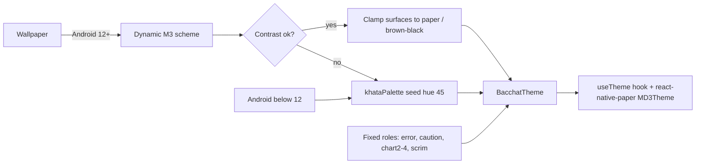
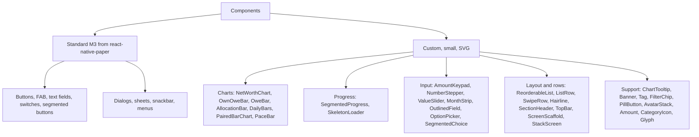

# Design system

Direction: **Khata** (a ruled household notebook). Serif numbers, hairline rules instead of cards, outline icons in tinted circles, close to stock Material 3. Chosen over Gullak (clay, playful, jar-fill goals) and Roz (diary with handwritten AI voice) for trust and restraint; it borrows Roz's docked Ask line and dashed "pending" outline for AI entries, and Gullak's jar-fill only for the goal-reached moment.

## Principles

1. Calm over clever. No red for spending, no alarms, no streak guilt.
2. Write it down, like a khata. Hairline rules, cards only where grouping helps.
3. Honest numbers. Net worth = own minus owe. Debt is always visible.
4. Private by default, said quietly once per context.
5. AI is a helper, not a host.
6. Built from Material 3. Custom components only where the data needs them.

## Colour

Material You: on Android 12+ the scheme derives from the wallpaper. The local module `modules/bacchat-dynamic-color` reads the system tonal palettes (accent1 to accent3, neutral1, neutral2) and `theme/dynamicScheme.ts` maps tones to roles (for example primary is accent1 tone 600 in light and 200 in dark). Bacchat clamps the surface roles so they never go pure white or black (a light surface above luminance 0.94 or a dark one below 0.004 is replaced by the khata value). When dynamic colour is unavailable (below Android 12, module missing, or the user turns wallpaper colours off) or the mapped scheme fails the 4.5:1 check on any of seven text pairs, the app uses the whole warm fallback generated from seed hue 45. The check re-runs when the app returns from the background, so a wallpaper change is picked up.

Error, caution, the chart colours and the scrim are never taken from the wallpaper. All fallback values are produced by one function of the seed hue (`khataPalette(hue, mode)` in `frontend/src/theme`). Other roles are placed at fixed hue offsets from the seed: secondary +35, tertiary +140, chart3 +75, error fixed at 28, caution fixed at 85/75/65.

### Role table (seed hue 45)

Values are oklch, with the sRGB hex they convert to. "Key" is the short name used in the design source and in `khataPalette`.

| Role | Key | Light | Dark | Used for |
|---|---|---|---|---|
| primary | `p` | `oklch(0.52 0.11 45)` `#9C522E` | `oklch(0.8 0.1 45)` `#F4A988` | Buttons, chart line, income, active nav |
| onPrimary | `op` | `oklch(0.97 0.01 45)` `#FBF3F0` | `oklch(0.28 0.07 45)` `#441B06` | Text on primary |
| primaryContainer | `pc` | `oklch(0.87 0.055 45)` `#F4CAB7` | `oklch(0.38 0.075 45)` `#63341E` | Illustration blob, tonal fills |
| onPrimaryContainer | `opc` | `oklch(0.3 0.07 45)` `#4A200C` | `oklch(0.91 0.05 45)` `#FFD8C6` | Text on primaryContainer |
| secondaryContainer | `sc` | `oklch(0.895 0.03 80)` `#E7DBC7` | `oklch(0.33 0.03 80)` `#3E3424` | Category icon circles, selected chips |
| onSecondaryContainer | `osc` | `oklch(0.32 0.04 80)` `#3E311A` | `oklch(0.9 0.03 80)` `#E9DCC8` | Icons on secondaryContainer |
| tertiaryContainer | `tc` | `oklch(0.885 0.045 185)` `#B9E3DD` | `oklch(0.34 0.045 185)` `#18403B` | AI insights and "to review" tags only |
| onTertiaryContainer | `otc` | `oklch(0.32 0.05 185)` `#0C3B36` | `oklch(0.9 0.04 185)` `#C2E7E1` | Text on tertiaryContainer |
| surface | `bg` | `oklch(0.955 0.012 45)` `#F8EEEA` | `oklch(0.195 0.012 45)` `#1A1310` | Page background. Soft paper, not white |
| surfaceContainer | `s1` | `oklch(0.93 0.015 45)` `#F1E5E0` | `oklch(0.23 0.014 45)` `#231B18` | Nav bar, sheets, search |
| surfaceContainerHigh | `s2` | `oklch(0.9 0.019 45)` `#EADAD4` | `oklch(0.27 0.016 45)` `#2D2420` | Inactive tracks, bars, chips |
| surfaceContainerLowest | `s3` | `oklch(0.972 0.01 45)` `#FCF4F0` | `oklch(0.165 0.01 45)` `#120D0B` | Selected option background in sheets |
| onSurface | `on` | `oklch(0.26 0.02 45)` `#2D211C` | `oklch(0.92 0.012 45)` `#ECE2DE` | Text and spends. Warm charcoal |
| onSurfaceVariant | `onv` | `oklch(0.47 0.025 45)` `#67574F` | `oklch(0.76 0.02 45)` `#BDADA7` | Secondary text, captions |
| outlineVariant | `ol` | `oklch(0.85 0.018 45)` `#D9CAC4` | `oklch(0.34 0.015 45)` `#3F3632` | Hairline rules |
| outline | `ol2` | `oklch(0.62 0.02 45)` `#91837C` | `oklch(0.55 0.02 45)` `#7C6E68` | Field borders, inactive knobs |
| error | `er` | `oklch(0.52 0.13 28)` `#A7463C` | `oklch(0.8 0.09 28)` `#F2A89D` | Field errors, Delete, badges. Never amounts |
| inverseSurface | `inv` | `oklch(0.3 0.02 45)` `#372B26` | `oklch(0.9 0.012 45)` `#E5DCD8` | Tooltips, snackbars |
| inverseOnSurface | `oninv` | `oklch(0.93 0.012 45)` `#EFE6E1` | `oklch(0.25 0.02 45)` `#2A1F1A` | Text on inverseSurface |
| caution (fixed) | `cc` | `oklch(0.91 0.055 85)` `#F2DFB8` | `oklch(0.36 0.06 75)` `#4F3815` | Over budget, conflicts. Not wallpaper-derived |
| onCaution (fixed) | `occ` | `oklch(0.38 0.07 65)` `#5C3A15` | `oklch(0.9 0.06 85)` `#F0DCB1` | Text and bar on caution |
| chart2 | `k2` | `oklch(0.62 0.08 185)` `#46968C` | `oklch(0.74 0.07 185)` `#76BAB0` | Chart series 2 (tertiary-strong) |
| chart3 | `k3` | `oklch(0.7 0.09 120)` `#97A766` | `oklch(0.68 0.08 120)` `#92A067` | Chart series 3 (75 degree neighbour) |
| chart4 | `k4` | `oklch(0.8 0.03 45)` `#CFB8AE` | `oklch(0.5 0.03 45)` `#725E55` | Chart series 4 (outline-like) |

### Colour rules

- Spends are onSurface, with no minus sign and never red. Income is primary with a "+". Debt is labelled with a word ("owed"), not a colour.
- Over budget and conflicts use the fixed caution container, never error red. Error is for field errors, Delete and badges, never for amounts.
- tertiaryContainer is reserved for AI insights and "to review" tags.
- Chart series are primary, chart2, chart3 and chart4 (outline-like): at most four colours per chart.
- Meaning never relies on colour alone; tags carry words (MATCHED, OWED, TO REVIEW).
- Text contrast is at least 4.5:1 in both modes. Dynamic schemes are re-checked at runtime.

## Typography

| Token | Spec | Example |
|---|---|---|
| displayMedium | Young Serif 40/44, -0.5 | Rs 18,22,350 |
| headlineSmall | Young Serif 24/30 | Money |
| titleMedium | Young Serif 18/24 (section heads) | Coming up |
| bodyLarge | Figtree 400, 15-16/22 | Third Wave Coffee |
| labelLarge | Figtree 600, 14, tabular figures | Rs 1,249 |
| bodySmall | Figtree 400, 12/16, onSurfaceVariant | Eating out, ICICI credit card |

Fonts are Young Serif (display, headline, title) and Figtree 400, 500 and 600 (everything else), loaded with expo-font before first render. The other tokens: bodyMedium 14/20, labelMedium 12/16, labelSmall 11/16. Language: English only. All strings go through the t() layer (`lib/i18n.ts` and the `i18n.*.ts` bundles).

## Shape, spacing, elevation

- Full-pill buttons and segmented controls; 12dp text fields; 8dp chips; 16dp cards (sparingly); 28dp sheets and dialogs; 40dp icon circles.
- 4dp grid; 20dp screen margin; 22dp above section heads; list rows 56-60dp.
- No elevation on content. Only menus, sheets and the FAB cast a shadow.

## Icons and illustration

- Category icons: outline, round caps, set in a 40dp secondaryContainer circle; the selected icon inverts to primary/onPrimary. `Glyph` draws a custom SVG icon when the name is one of ours, otherwise a Material icon.
- 180 category icons in total (`data/categoryIconCatalog.ts`): 143 finance and everyday icons plus 25 custom India-specific ones drawn as SVG paths on a 24 grid (`components/icons`): auto rickshaw, cooking gas cylinder, pooja thali, chai glass, tiffin, kirana store, sabzi cart, dhobi iron, milk packet, DTH dish, scooter, metro card, diya, rangoli and others.
- Current deviation: the non-custom glyphs come from `@expo/vector-icons` MaterialIcons (names mapped in `components/iconMap.ts`), not Material Symbols Rounded at weight 300. The custom set is drawn at the intended weight. Swapping the font later only touches `iconMap.ts`.
- Illustrations (`components/illustrations`): single-weight ink line drawings on one flat blob of primaryContainer, shipped as `react-native-svg` components with two tintable layers (`tint` for the blob, `ink` for the line). Built: chai glass, tiffin, coin, khata notebook, beach chair, and scenes for empty entries, goals, budget, accounts, search and upcoming, plus goal reached, sync done and the jar-fill used only for the goal-reached moment. Used for empty states, welcome, goal headers and success moments; never decoratively on data screens.

## Data visualisation

| Data | Chart | Interaction |
|---|---|---|
| Net worth over time | 2dp line, pale area, dashed rules, end dot | Scrub for value tooltip; 1M/6M/1Y/All chips |
| Own vs owe | Two-segment bar + equation rows | Tap info icon for rich tooltip |
| Asset allocation | 8dp stacked bar, 2x2 legend | Tap segment to filter Accounts |
| Daily spend | Rounded day bars, today in chart2, future dashed | Tap for tooltip: total, top 2, vs average, "See entries" |
| Spend by category | Share bar + rows with change vs last month | Tap row to filter Entries |
| Budget | 10dp track + "today" marker | Over: caution colour, never red |
| Goal | Segmented bar with quarter ticks | Ticks at 25/50/75% |
| Cash flow | Paired rounded columns, in and out | Tap month for net kept |

Tooltips use inverseSurface, sit above the touch point, clamp inside the screen, and track the finger with a 2px stem. Compact format (18.2L, 52k) in charts; full Indian grouping in text. Charts expose a TalkBack summary ("Spent Rs 2,890 on Sat 17 Oct, Rs 1,588 above average").

## Component inventory

All in `frontend/src/components`, one file each, reading colours, type and shapes from `useTheme()`.

## Voice

Second person, plain words, one idea per line, name the next step. Indian grouping (Rs 12,34,567) and dates like "Sat, 24 Oct".

| Say | Not |
|---|---|
| Eating out went Rs 640 past its budget. A couple of home dinners evens it out. | Budget exceeded by 10.7%! |
| Which Amazon payment is right? | Duplicate transaction conflict detected |
| Kept on this phone. | Your data is protected with bank-grade security |
| Yours to spend | Available liquidity |

## Accessibility

Touch targets at least 48dp; rows 56dp or more; keypad keys 44dp tall with 6dp gaps. Contrast at least 4.5:1. Meaning not by colour alone. Charts expose TalkBack summaries and focusable bars. Font scale to 200% with no truncated amounts. Reduce motion swaps scan, lift and slide animations for fades.
