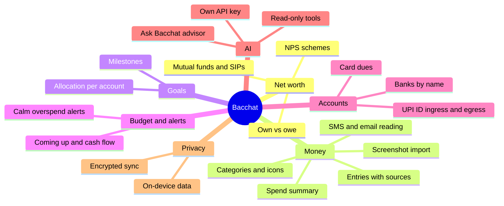

# Product

## Vision

Money creates anxiety; Bacchat should not add to it. It is a calm, private, open-source notebook for the money you own, owe, spend and save, built natively for Android. Everything runs on the phone. Cloud sync is opt-in and end-to-end encrypted.

## Features

1. Net worth with live data from mutual funds, SIPs and NPS schemes.
2. Savings goals; the user allocates money toward what they want to meet.
3. Transactions list with tagging and spend summaries.
4. AI bot that reads SMS and email to add and auto-tag transactions.
5. Bulk-add transactions by uploading a screenshot (OCR), reconciled against SMS and email entries.
6. Multiple spend types (credit card, debit, cash, UPI, etc.) with categories.
7. Multiple bank accounts, added by name only (no bank API linking).
8. UPI ID tracking with ingress and egress per ID.
9. Overspending alerts.
10. Budgeting.
11. Optional AI advisor with the user's own API key, working like an MCP client with read-only financial tools.
12. Privacy-first: as much as possible runs client-side.

## Experience goals

Calm and unintimidating tone; icon-led categorisation (about 180 icons); hand-drawn illustration touches; an upcoming and recurring calendar with cash flow; four tabs with contextual insights; characterful numerals; a customisable Home that opens on net worth; AI that is minimal but visible; INR with Indian number format; useful empty states; accessible contrast and touch targets. These borrow the philosophy of Fold Money, not its branding or assets.

## Personas

- Rahul, 30s, salaried, has two credit cards, a few SIPs and an NPS account. Wants one honest number and no nagging.
- A privacy-minded user who will only use a finance app that keeps data on the device and can self-host sync.
- A new user with no data, who needs a friendly empty state and a fast first entry.

## Scope

v1: the 12 features above on-device, sample-data-driven UI for all screens, encrypted sync via the Bacchat backend.

Later: loans and EMIs with amortisation, Hindi localisation, full illustration set, Google Drive and WebDAV/S3 sync targets, live NAV fetching.
