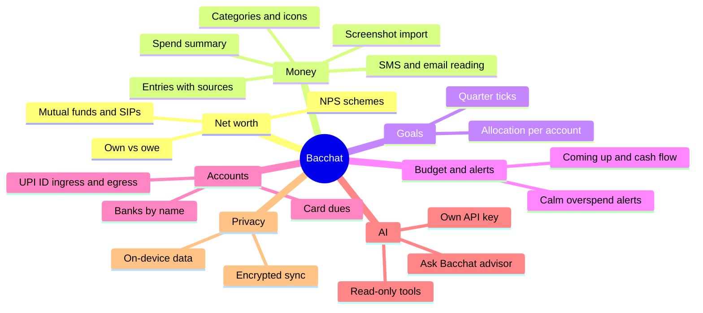

# Product

## Vision

Money creates anxiety; Bacchat should not add to it. It is a calm, private, open-source notebook for the money you own, owe, spend and save, built with React Native, Android first. Everything runs on the phone. Cloud sync is opt-in and end-to-end encrypted.

## Features

1. Net worth with live data from mutual funds, SIPs and NPS schemes.
2. Savings goals; the user allocates money toward what they want to meet.
3. Transactions list with tagging and spend summaries.
4. AI bot that reads SMS and email to add and auto-tag transactions.
5. Bulk-add transactions by uploading a screenshot (OCR), reconciled against SMS and email entries.
6. Multiple spend types (credit card, debit, cash, UPI, etc.) with categories.
7. Multiple bank accounts, added by name only (no bank API linking).
8. UPI ID tracking with ingress and egress per ID.
9. Overspending alerts.
10. Budgeting.
11. Optional AI advisor with the user's own API key, working like an MCP client with read-only financial tools.
12. Privacy-first: as much as possible runs client-side.

## Experience goals

Calm and unintimidating tone; icon-led categorisation (about 180 icons); hand-drawn illustration touches; an upcoming and recurring calendar with cash flow; four tabs with contextual insights; characterful numerals; a customisable Home that opens on net worth; AI that is minimal but visible; INR with Indian number format; useful empty states; accessible contrast and touch targets. These borrow the philosophy of Fold Money, not its branding or assets.

## Personas

- Rahul, 30s, salaried, has two credit cards, a few SIPs and an NPS account. Wants one honest number and no nagging.
- A privacy-minded user who will only use a finance app that keeps data on the device and can self-host sync.
- A new user with no data, who needs a friendly empty state and a fast first entry.

## Scope

v1 as built: all 12 features run on the phone against a local encrypted database. A fresh install opens in a clearly marked sample notebook so every screen has something to show, and the user can leave it to start empty. Encrypted sync works with Bacchat Cloud, WebDAV, S3-compatible servers and Google Drive. Fund and NPS values refresh from public NAV files. AI routes between the user's own cloud key and a model on the phone.

| Feature | Status in code | Notes |
|---|---|---|
| 1 Net worth, funds, SIPs, NPS | Done | NAVs fetched anonymously once a day; the NPS source URL is unverified and is a setting |
| 2 Goals | Done | Allocation per account, segmented bar with quarter ticks, goal-reached moment |
| 3 Entries, tags, summaries | Done | Day groups, filters, search, select mode, undo |
| 4 SMS and email reading | SMS done, email by paste | No mailbox integration; Kotlin receiver not yet run on a device |
| 5 Screenshot import | Done | ML Kit OCR module, reconciliation, conflict sheet |
| 6 Spend types and categories | Done | About 180 category icons, 25 of them custom India-specific |
| 7 Bank accounts by name | Done | No bank linking |
| 8 UPI ID tracking | Done | Ingress and egress per ID |
| 9 Overspending alerts | Done | Inline caution banner, at most one per category per month |
| 10 Budgeting | Done | Per category, pace marker |
| 11 AI advisor | Done | Own key or on-device model, five read-only tools |
| 12 Privacy first | Done | SQLCipher, optional app lock, backup off, opt-in encrypted sync |

Also built: Home arrangement (reorder and hide), upcoming and recurring view with cash flow, biometric or screen-lock app lock, launcher shortcut and share-sheet entry, recovery key and passphrase change for sync, pairing a second phone.

Later: loans and EMIs with amortisation (loans are a manual balance for now), a mailbox integration for email, the commissioned illustration set and icons (the current ones are drawn in code), pinned on-device model URLs and checksums.
