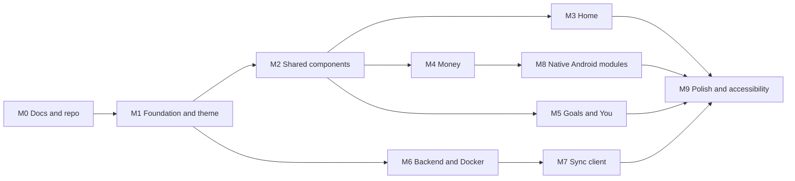

# Progress

Last updated: 2026-10-06. Update with every meaningful change, together with worklog.md.

## Milestones

- [ ] M0 Docs and repo: CLAUDE.md, docs set, repo layout, CI skeleton (docs written; CI workflows pending)
- [ ] M1 Frontend foundation and theme: Expo project, TypeScript strict, oklch conversion, khataPalette, Paper theme adapter, fonts, i18n, navigation shell, sample data
- [ ] M2 Shared components: charts (NetWorthChart, OwnOweBar, AllocationBar, DailyBars, PairedBarChart), SegmentedProgress, MonthStrip, AmountKeypad, ReorderableList, NumberStepper, AvatarStack, ChartTooltip, Banner, skeleton
- [ ] M3 Home screens: k21, k22, k1, k2, k18
- [ ] M4 Money screens: k3, k4, k5, k6, k7, k8, k9, k19, k27, k28 and the reconcile lib
- [ ] M5 Goals and You screens: k12, k13, k14, k23, k10, k11, k15, k16, k17, k24
- [ ] M6 Backend and Docker: API from backend.md, SQLite storage, cap, tests, Dockerfile, compose
- [ ] M7 Sync client: Argon2id and XChaCha20-Poly1305, push and pull with baseVersion, k25, k26, k9 conflict reuse
- [ ] M8 Native Android modules: SMS and notification reader, share intent, Material You dynamic colour, keystore and biometrics, launcher shortcut
- [ ] M9 Polish and accessibility: TalkBack summaries, 200% font scale, reduce motion, contrast audit, empty states, illustrations

## Next steps

1. Land the frontend foundation (M1) with theme tests against the design-system hex table.
2. Land the backend skeleton with register, blobs and health, plus its Dockerfile (M6).
3. Add CI workflows for frontend, backend and docs checks.
4. Fill the Latest results table in testing.md after the first green runs.
5. Decide device enrolment for sync (second phone getting a token) before M7.

## Blockers and risks

| Item | Impact | Plan |
|---|---|---|
| Android SDK unreachable in the sandbox | Cannot build or run the app here | Rely on Jest, typecheck and lint here; verify on a real device and in CI later |
| Docker daemon unavailable in the sandbox | Cannot build or run the image here | Test backend as a Node process; validate the image in CI |
| Fonts (Young Serif, Figtree) not yet bundled; Hindi serif pairing open | Typography falls back to system fonts | Add font files via expo-font; keep fallbacks; resolve open question 4 |
| Material You native module | Third-party module or small local module, needs a device | Warm fallback palette is always available; record choice in decisions.md |
| SQLCipher library choice | Affects native build and migrations | Pick between op-sqlite and expo-sqlite with SQLCipher in M1 |
| Illustrations and India-specific icons not commissioned | Empty states use placeholders | Open questions 3 in CLAUDE.md |
| Hosting and free cap for Bacchat Cloud | Policy not fixed | Default 500 MB per account; self-hosting supported |

## Screen status summary

The per-screen table is in [screens.md](screens.md) (29 rows including the debug galleries k20 and k29). Rolled up here.

| Group | Screens | Todo | In progress | Done |
|---|---|---|---|---|
| Start | k21, k22 | 2 | 0 | 0 |
| Home | k1, k2, k18 | 3 | 0 | 0 |
| Money | k3, k4, k5, k6, k7, k8, k9, k19, k27, k28 | 10 | 0 | 0 |
| Goals | k12, k13, k14 | 3 | 0 | 0 |
| You | k23, k10, k11, k15, k16, k17, k24, k25, k26 | 9 | 0 | 0 |
| Debug | k20, k29 | 2 | 0 | 0 |
