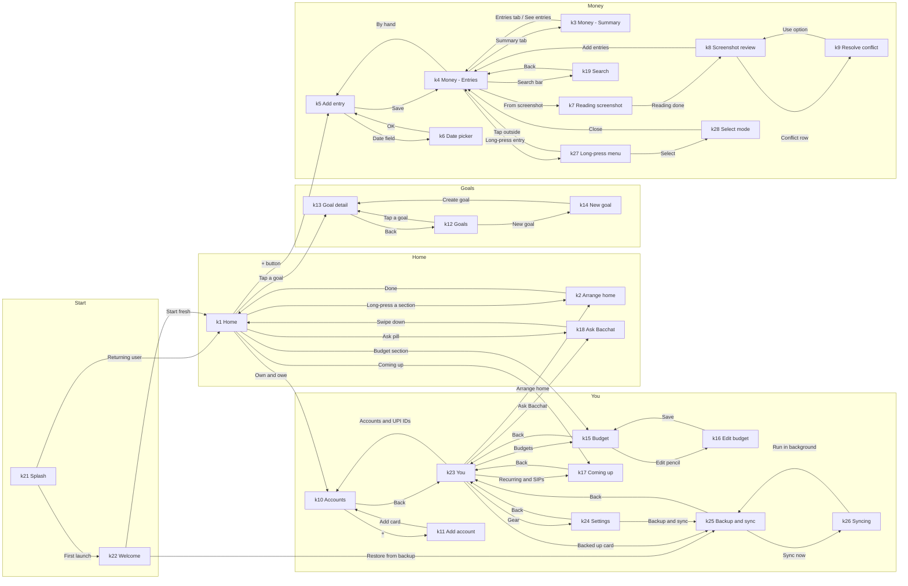

# Screens

Screens are identified by the k-ids from the Khata v2 design. Status values: todo, in progress, done. Update this table as screens land.

## Navigation

Four tabs (Home, Money, Goals, You) are reachable from each other at any tab root. Edges below are the non-tab transitions from the navigation guide.

## Rules

- Tab bar shows only on k1, k3, k4, k12, k23. Re-tapping the current tab scrolls to top. Money remembers Summary vs Entries.
- Sheets and dialogs (k6, k9, k18, k27) sit over their parent; swipe down, tap the scrim or press back to return exactly where you were.
- External entry points: share an image into Bacchat opens k7; a "From SMS" notification opens k4 filtered to To review; the launcher shortcut "Add entry" opens k5.

## Screen table

| k-id | Screen | Route | Tab | Kind | Status | Notes |
|---|---|---|---|---|---|---|
| k21 | Splash | `splash` | Start | screen | todo | |
| k22 | Welcome | `welcome` | Start | screen | todo | |
| k1 | Home | `home` | Home | tab | todo | |
| k2 | Arrange home | `arrange_home` | Home | screen | todo | |
| k18 | Ask Bacchat | `ask` | Home | sheet | todo | |
| k3 | Money - Summary | `money/summary` | Money | tab | todo | |
| k4 | Money - Entries | `money/entries` | Money | tab | todo | |
| k5 | Add entry | `money/add` | Money | screen | todo | |
| k6 | Date picker | `money/date` | Money | dialog | todo | |
| k7 | Reading screenshot | `money/reading` | Money | screen | todo | |
| k8 | Screenshot review | `money/review` | Money | screen | todo | |
| k9 | Resolve conflict | `money/conflict` | Money | sheet | todo | |
| k19 | Search | `money/search` | Money | screen | todo | |
| k27 | Long-press menu | `money/entry_menu` | Money | menu | todo | |
| k28 | Select mode | `money/select` | Money | mode | todo | |
| k12 | Goals | `goals` | Goals | tab | todo | |
| k13 | Goal detail | `goals/detail` | Goals | screen | todo | |
| k14 | New goal | `goals/new` | Goals | screen | todo | |
| k23 | You | `you` | You | tab | todo | |
| k10 | Accounts | `you/accounts` | You | screen | todo | |
| k11 | Add account | `you/accounts/add` | You | screen | todo | |
| k15 | Budget | `you/budget` | You | screen | todo | |
| k16 | Edit budget | `you/budget/edit` | You | screen | todo | |
| k17 | Coming up | `you/coming_up` | You | screen | todo | |
| k24 | Settings | `you/settings` | You | screen | todo | |
| k25 | Backup and sync | `you/sync` | You | screen | todo | |
| k26 | Syncing | `you/sync/progress` | You | screen | todo | |
| k20 | Component sheet 1 | `debug/components` | Debug | gallery | todo | |
| k29 | Component sheet 2 | `debug/components2` | Debug | gallery | todo | |
