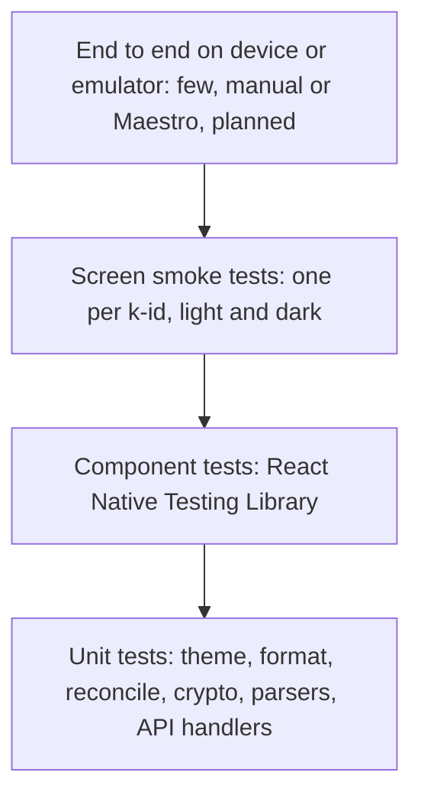

# Testing

Rule one: never commit on a red build. Never skip, disable or delete a test to get green; fix the cause. New code ships with tests.

## Strategy

Most tests are fast unit tests on pure code (colour maths, formatters, reconciliation, crypto wrappers). Fewer component and screen tests sit above them, and a small set of end-to-end checks sits on top.

Pyramid by volume, widest at the bottom: unit, then component, then screen, then end to end.

## Commands

Frontend (Node 20+):

| Command | What it does |
|---|---|
| `cd frontend && npm install` | Install dependencies |
| `npm run typecheck` | TypeScript, strict mode |
| `npm run lint` | ESLint |
| `npm test` | Jest and React Native Testing Library |
| `npx expo run:android` | Run on device or emulator (needs Android SDK) |

Backend (Node 20+):

| Command | What it does |
|---|---|
| `cd backend && npm install` | Install dependencies |
| `npm run typecheck` | TypeScript |
| `npm run lint` | ESLint |
| `npm test` | API tests against an in-process server and a temp data dir |
| `docker build -t bacchat-backend .` | Build the image (needs a Docker daemon) |

The exact script names live in each `package.json`; keep this page in sync.

## What is tested per layer

| Layer | Tests |
|---|---|
| Theme | oklch to sRGB conversion against known hex values from the role table in design-system.md (for example `oklch(0.52 0.11 45)` gives `#9C522E`, with a small tolerance per channel); `khataPalette(45, light)` and dark equal the table; contrast ratio function against known pairs; every text role pair in both modes at least 4.5:1; clamp never returns pure white or black; fallback chosen when a dynamic scheme fails the check |
| lib/format | Indian grouping (Rs 12,34,567), compact format (18.2L, 52k), paise to rupees, no floats, dates like "Sat, 24 Oct", negative and zero cases |
| lib/reconcile | Matched (all three agree), Conflict (two of three), New; the 10 minute boundary; fuzzy merchant cases; saved "trust screenshots" rule; unknown payee gives "Pick a category" |
| lib/parsers | SMS and notification samples from common Indian banks give amount, direction, merchant; unparseable text returns nothing, not a guess |
| lib/crypto and sync client | Argon2id key derivation is deterministic for a salt; encrypt then decrypt round trip; tamper detection; wrong key fails; push with baseVersion, 409 path leads to a resolve state (HTTP mocked) |
| lib/ai | Tool functions return aggregates only and never raw rows; no write tools are registered |
| data | Repositories on an in-memory SQLite: CRUD, tombstones, summaries as SQL aggregates |
| Components | Render in light and dark, chart accessibility summaries present, keypad key size, tags carry words not just colour |
| Screens | One smoke test per k-id: renders with sample data, carries its k-id header, no hard-coded colours (lint rule), light and dark; key navigation edges from screens.md |
| Backend API | Healthz; register returns token and stores only its hash; PUT/GET round trip; If-Match conflict returns 409; MAX_BLOB_BYTES gives 413; storage cap gives 507; list; device list and revoke; account delete removes blobs; auth failures give 401 |

## Backend demo

`cd backend && npm run demo` starts an in-process server (temp SQLite, tiny caps) and walks through every backend feature with PASS/FAIL output: health and headers, register, auth failures, push and pull, optimistic concurrency (409), blob listing and usage, size and account caps (413), pairing a second device, two-device conflict, device list and revoke, device limit, account isolation, persistence across a restart, account deletion and rate limiting (45 checks).

To test a running server, for example the Docker image: `DEMO_URL=http://localhost:8080 npm run demo` (the cap and device-limit checks that need small limits are skipped in that mode).

There is no CI in this repository; run the checks locally before every commit.

## Latest results

Filled in by the lead after each run. Leave blanks until then.

| Date | Area | Command | Result | Tests passed | Notes |
|---|---|---|---|---|---|
| 2026-10-06 | frontend | `npm run typecheck` | pass | n/a | tsc strict |
| 2026-10-06 | frontend | `npm run lint` | pass | n/a | max-warnings 0, hex literals banned outside tests |
| 2026-10-06 | frontend | `npm test` | pass | 516 in 33 suites | theme, lib, data, components, all 29 screens in light and dark; act() warnings from icon fonts remain |
| 2026-10-06 | backend | `npm test` | pass | 37 | memory and SQLite stores |
| 2026-10-06 | backend | `docker build` | not run | n/a | no Docker daemon in this sandbox; Dockerfile reviewed by hand |
| 2026-10-06 | docs | ASCII check | pass | n/a | Mermaid not rendered yet |

## Known sandbox limits

- No Android SDK in the development sandbox, so the app cannot be built or run on an emulator here. Jest, typecheck and lint still run. Native module behaviour (SMS, share, Material You, keystore) must be checked on a real device later.
- No Docker daemon in the sandbox, so `docker build` and compose cannot be verified here. The backend is tested as a plain Node process; the image can be validated with `DEMO_URL=... npm run demo` against a running container.
- Network access is limited, so tests never depend on live NAV files or AI providers; use recorded fixtures.
