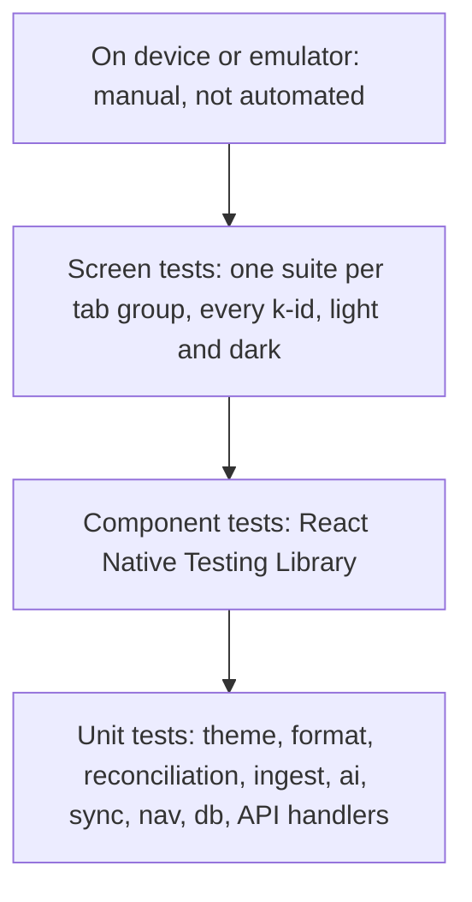

# Testing

Rule one: never commit on a red build. Never skip, disable or delete a test to get green; fix the cause. New code ships with tests.

## Strategy

Most tests are fast unit tests on pure code (colour maths, formatters, reconciliation, parsers, crypto, merge). Component and screen tests sit above them. There are no automated end-to-end device tests; on-device checks are manual (see the list in [architecture.md](architecture.md), section 14).

Pyramid by volume, widest at the bottom: unit, then component, then screen, then manual device checks.

## Commands

Frontend (Node 20+):

| Command | What it does |
|---|---|
| `cd frontend && npm install` | Install dependencies |
| `npm run typecheck` | `tsc --noEmit`, strict mode |
| `npm run lint` | `eslint . --max-warnings 0` (hex colour literals are banned outside tests) |
| `npm test` | Jest (`jest-expo` preset) and React Native Testing Library |
| `npx expo run:android` | Build and run a dev build on a device or emulator (needs Android SDK) |

Backend (Node 20+):

| Command | What it does |
|---|---|
| `cd backend && npm install` | Install dependencies |
| `npm run typecheck` | `tsc --noEmit` |
| `npm run lint` | ESLint |
| `npm test` | Vitest: API tests against an in-process Fastify app on the in-memory and SQLite stores |
| `npm run demo` | End-to-end walkthrough with PASS/FAIL output (see below) |
| `docker build -t bacchat-backend .` | Build the image (needs a Docker daemon) |

The exact script names live in each `package.json`; keep this page in sync.

## What is tested per layer

| Layer | Where | Tests |
|---|---|---|
| Theme | `src/theme/__tests__` | oklch to sRGB against the hex values in design-system.md; `khataPalette(45, light/dark)` equals the role table; contrast ratio function; every text pair at least 4.5:1 in both modes; surface clamp; fallback chosen when a dynamic scheme fails; dynamic tone mapping |
| lib/format and i18n | `src/lib/__tests__` | Indian grouping (Rs 12,34,567), compact format (18.2L, 52k), paise to rupees, dates like "Sat, 24 Oct"; key coverage of t() |
| lib/reconciliation | `src/lib/__tests__` | Matched, Conflict, New; the 10 minute boundary; fuzzy merchant cases; saved "trust screenshots" rule; unknown payee gives "Pick a category" |
| lib/ingest | `src/lib/ingest/__tests__` | SMS, email and OCR row samples from common Indian banks give amount, direction, merchant; unparseable or not-a-payment text returns nothing; pipeline outcomes (added, matched, conflict, duplicate, ignored) |
| lib/ai | `src/lib/ai/__tests__`, `provider/__tests__` | Router modes and fallbacks; consent gate; redaction and the second sensitive-pattern check; extraction cross-checks; tools return aggregates only and the tool set is fixed read-only; providers against recorded responses; on-device model download, resume and verify |
| lib/sync | `src/lib/sync/__tests__` | Argon2id determinism; encrypt then decrypt round trip; tamper and wrong-key failure; keyring open with passphrase and recovery key, re-wrap; three-way merge and conflicts; engine push, pull, 409 path, rollback guard; WebDAV, S3 (SigV4) and Drive targets against fake HTTP |
| lib/nav | `src/lib/nav/__tests__` | AMFI and NPS parsers on fixtures, valuation, cache and stale handling |
| data | `src/data/db/__tests__`, `src/data/__tests__` | Repositories on sql.js: CRUD, tombstones, migrations, derived balances, spend and budget queries, seed numbers |
| services | `src/services/__tests__` | Services factory, DB key provider, secure store, app lock, ingest service and pending conflicts, share service, SMS headless task, sync data source |
| Navigation | `src/navigation/__tests__` | Manifest vs registry vs edges, tab bar visibility, linking config |
| Components | `src/components/__tests__` | Render in light and dark, chart accessibility summaries, keypad key size, tags carry words not just colour |
| Screens | `src/screens/*/__tests__` | Each k-id renders with sample data, carries its k-id header, light and dark; key navigation edges; flows (add entry, import, sync setup, settings) |
| Native modules and plugins | `modules/*/src/__tests__`, `plugins/__tests__` | TypeScript wrappers against fakes; config plugin output. The Kotlin code is not exercised |
| Backend API | `backend/test` | Healthz and headers; register returns a token and stores only its hash; pairing and device limit; PUT/GET round trip; baseVersion conflict gives 409; nonce length and base64 checks; blob name pattern; `MAX_BLOB_BYTES` and storage cap give 413; list; device list and revoke; account delete removes blobs; auth failures give 401; rate limits give 429 |

## Backend demo

`cd backend && npm run demo` starts an in-process server (temp SQLite, tiny caps) and walks through every backend feature with PASS/FAIL output: health and headers, register, auth failures, push and pull, optimistic concurrency (409), blob listing and usage, size and account caps (413), pairing a second device, two-device conflict, device list and revoke, device limit, account isolation, persistence across a restart, account deletion and rate limiting (45 checks).

To test a running server, for example the Docker image: `DEMO_URL=http://localhost:8080 npm run demo` (the cap and device-limit checks that need small limits are skipped in that mode).

## Continuous integration

There is no CI in this repository (no `.github` workflows). Run typecheck, lint and tests locally before every commit.

## Latest results

| Date | Area | Command | Result | Count | Notes |
|---|---|---|---|---|---|
| 2026-10-08 | frontend | `npm run typecheck` | pass | n/a | tsc strict |
| 2026-10-08 | frontend | `npm run lint` | pass | n/a | max-warnings 0 |
| 2026-10-08 | frontend | `npm test` | pass | 1524 tests in 103 suites | about 77 s |
| 2026-10-08 | backend | `npm run typecheck` and `npm run lint` | pass | n/a | |
| 2026-10-08 | backend | `npm test` | pass | 37 tests in 2 files | |
| 2026-10-08 | backend | `npm run demo` | pass | 45 checks | in-process server |
| 2026-10-08 | backend | `docker build` | not run | n/a | no Docker daemon in this sandbox; Dockerfile reviewed by hand |

## Known sandbox limits

- No Android SDK in the development sandbox, so the app cannot be built or run on an emulator here. Jest, typecheck and lint still run. Native module behaviour (SMS, share, Material You, OCR, keystore, llama.rn) must be checked on a real device.
- No Docker daemon in the sandbox, so `docker build` and compose cannot be verified here. The backend is tested as a plain Node process; the image can be validated with `DEMO_URL=... npm run demo` against a running container.
- Network access is limited (the AMFI and NPS sites were not reachable), so tests never depend on live NAV files, sync servers or AI providers; they use fixtures and fakes.
- Jest runs with mocks for the native pieces (vector icons render as text, Reanimated and worklets use their official mocks, AsyncStorage uses its in-memory mock).
